<p align="center">
  
</p>

<p align="center">
  <a href="README.md">English</a> · <a href="README.ko.md">한국어</a> · <strong>日本語</strong> · <a href="README.zh.md">中文</a>
</p>

<h1 align="center">cladding</h1>

<p align="center">
  <strong>AI にコーディングを任せるには、組織に三つの条件が要る —<br/>コードを信頼でき、その足跡をたどれ、規模が大きくなっても揺るがないこと。cladding はその三つを築く。</strong><br/>
  その名（cladding = 外装材）のとおり、ホスト LLM を包み込み、その前と後を検証する層だ。
</p>

<p align="center">
  <a href="https://github.com/qwerfunch/ironclad"></a>
  <a href="https://github.com/qwerfunch/ironclad"></a>
  
  
  <a href="LICENSE"></a>
</p>

<p align="center">
  <a href="https://github.com/qwerfunch/ironclad">Ironclad</a> 標準の公式リファレンス実装。<br/>
  ホスト LLM（Claude Code · Codex · Gemini · Cursor）が作業を <em>始める前</em> に、cladding がプロジェクトの意図を渡し、<br/>
  作業を <em>終えた後</em> に、41 個の検出器と 15 段階のゲートで結果を検証する。
</p>

<!-- ─────────────── Why an enterprise can trust AI with coding ─────────────── -->
- **検証されたコードだけが「完了」として出荷される** — AI が「できました」と言っても、検査を通さなければならない — だから検証できなかったコードが「完了」と認められることはない。
- **出荷されたものは記録に残る** — 何を検証したかはコミットされた内容に刻まれ、誰がいつやったかはローカルのセッション台帳に、なぜかは spec に残る — だから引き継ぎもレビューも、決定を掘り起こさずにたどれる。
- **チームが大きくなり、AI を増やしても揺るがない** — spec が共通の土台なので、衝突も乖離も自動でせき止められる。

<!-- ─────────────── Host-LLM partnership loop ─────────────── -->
<div align="center">


</div>

> **このループが狙うのはただ一つ —** AI の *「できました」* を、口先の **主張** から **証明** へと変えることだ。

だから、AI が書いたコードを **人が書いたコードと同じ信頼で** 送り出せる。

cladding は **自分自身も cladding で作っている** — 254 個の feature のうち 251 個が同じゲートを通過した、Ironclad 標準を L4 で実装した最初の事例だ。

<!-- ─────────────── How it partners with the host LLM ─────────────── -->

## ホスト LLM とどう協働するか

#### 前 — 意図を注入する

*LLM が正しいコンテキストで始められるように。*

- **プロジェクトマップの注入** — 会話が始まるたびに「feature がいくつあり、何が進行中で、直近の検証結果はどうか」が自動で LLM に渡される <sub>（いまはあなたの目でも確認できる ↓）</sub>。
- **効く意図だけを抽出** — いま扱っている feature の *なぜ*、関連する feature、そして受け入れ基準だけを取り出す（spec 全体をそのまま流し込んだりしない）。
- **プロジェクトのルールを適用** — チームで合意した禁止パターンと推奨パターンを、毎回の常設指示として渡す。

**後 — 検証する:** 15 段階のゲート、41 個の乖離検出器、そして実装を見ない採点者（下記）。

<sub>リアルタイム介入（マップ注入 · 即時ブロック · 終了ブロック）は Claude Code ですべて動作する。Codex · Gemini · Cursor では同じ検証を、会話中のツール呼び出しと git · CI のゲートで通す。</sub>

<!-- ─────────────── done is earned ─────────────── -->

## 「done」は宣言ではなく、勝ち取るものだ

AI コーディングの持病は、検証の裏づけなしに *「できました」* と宣言されることだ。cladding では、feature の `status: done` は自分で書き込む値ではなく、**勝ち取る** 値だ。

<div align="center">


</div>

① AI が完了マークを **自分で書き込もう** とすると → **その場でブロック** される（「完了は検証で勝ち取ってください」）。

② AI が完了を **要求** すると → 決定的な 9 段階をすべて回し、**全部が通ったときだけ** done として記録する。一つでも落ちれば自動で巻き戻す — E2E · 証拠の段階は CI の全 15 段階が担う。

③ 通過した瞬間に **検証署名** が残る — 「このコードはこの時点で検証された」というコミット可能な証拠だ。

④ 失敗を残したまま会話を終えようとすると → **一度は押しとどめ**（同じ失敗でもう一度終えようとすると、通すのではなく事実を記録する）、修正カードを次の会話へ引き継ぐ。

限界も包み隠さず開示する: 即時ブロックが見逃す抜け道は存在し、その場合は事後検証（ゲート · 乖離チェック）が捕まえる。即時ブロックが第一の防衛線、事後検証が第二の防衛線であり、どちらも単独では保証にならない。

<!-- ─────────────── What changes ─────────────── -->

## 何が変わるか

同じ状況で、*素の AI コーディング環境* と cladding 環境の振る舞いがどう違うか。

| 状況 | 素の AI コーディング | cladding |
|---|:---|:---|
| **コードが spec から乖離する** | レビューで *気づけば* 直る | 編集直後に自動検知（アラート）· 乖離したままでは「完了」が通らない |
| **AI が「できました」と言う** | 言葉を信じるしかない | ゲートが GREEN のときだけ `done` を獲得 |
| **失敗した状態でセッションを終える** | そのまま終了し、次回には忘れられる | 終了を一度止め、修正カードを引き継ぐ |
| **二人が同時に feature を追加する** | merge conflict | hash-8 ID · ファイル分離 → 衝突 0 |
| **AI が書いたコードは誰が検証する？** | 書いた AI が自分で検証する（危うい） | 実装を見ない採点者 + 機械的なゲート |
| **AI ツールを乗り換える** | ツールごとに再設定 | 1 つの spec → 4 つの host へ自動配線 |

<!-- ─────────────── Project map (knowledge graph) ─────────────── -->

## プロジェクトマップ — いまは目で見て、問いかけられる <sub>新</sub>

cladding は spec · コード · テスト · ドキュメントをつなぐ **マップ** を、常に内部に描いている。そのマップを、いまはあなたの目で直接見られる。

> **なぜ効くのか — 説明とコードが離れていかない。**
> ドキュメントは時間が経つと嘘をつく — コードは変わるのに、説明はそのまま残るからだ。cladding はその結びつきをコードを読むたびに突き合わせ直し、ずれている間は「完了」を止める。

青が spec（中心）、オレンジがコード、緑がテスト、ピンクがドキュメント。つながりが多いノードほど大きくなり、中心へ引き寄せられる。

<div align="center">


</div>

- **見る — プロジェクト全体を一枚のキャンバスに** — `clad graph serve` を実行し、表示された localhost アドレスをブラウザで開けば、何が何につながっているか一目でわかる。
- **尋ねる — 「ここを直したら何が壊れる？」** — マップに尋ねれば、影響が及ぶ箇所と回すべきテストを教えてくれる — 当て推量ではない。
- **測る — プロジェクトが大きいほど効く** — 何かを直すときに目を通す量が一気に減る — すべてを読む場合に比べて平均 **4×** 少ない。（`clad measure`）

自分で起動するには — プロジェクトのフォルダで:

```bash
clad graph serve                                  # ライブグラフ — localhost:3000、保存すると自動リロード
clad graph export --format html --out graph.html  # または単一のオフラインファイル（.html）に書き出す
```

<sub>どちらも cladding 0.7.0+ が必要。</sub>

<!-- ─────────────── How it works ─────────────── -->

## How it works

**Spec → Code → Tests** が一つの cycle として回る — spec が *なぜ* を記録し、ゲートが検証し、detector が乖離をせき止める。

<div align="center">


</div>

### 1. Spec — 意図の唯一の源（SSoT）

spec が *なぜ*（何を、なぜ作るのか）を記録する。4 階層の単一の真実の源（SSoT）— *意図が上、実装が下、コードは spec に従う*。

| Tier | 役割 | 定義 · 作成 | 権限 |
|---|---|---|---|
| **A — Spec** | 意図（何を · なぜ） | 人が意図を定義 → LLM が EARS 形式で記述 | 封印済み · 人の承認なしに変わらない · すべてに優先 |
| **B — Design** | 設計（どうやって） | 人が方向づけ → LLM が記述 | A と照合 |
| **C — Derived** | 実装（コード · テスト） + **attestation**（検証署名） | LLM が記述 | コードを読んで自動再生成 |
| **D — Audit** | 監査記録（実際に起きたこと） | 自動記録（append-only） | ローカル |

**A は下位のすべての tier に優先する** — spec（A）とコード（C）が食い違えば、間違っているのは *コード* の方だ。

**シャーディング · マルチ開発者でも安全** — `spec/features/<slug>-<hash8>.yaml` のように、*feature ごとに専用ファイル* + *8 文字のハッシュ ID*（例: `F-d86375d8`）。二人が同時に新しい feature を作っても *別ファイル · 別 ID* になるので、merge conflict はゼロ。詳しくは [Hash-based feature IDs](docs/spec-ids-multi-dev.md)。

<div align="center">


</div>

### 2. Gate — 15 段階の Iron Law

検査エンジンは一つ、**コストで束ねる**: commit で 3 段階、push · 完了で 9 段階、CI で 15 段階すべて。違うのは深さだけだ。

<div align="center">


</div>

| Stage | 何を検査するか |
|---|---|
| **1.1 Type · 1.2 Lint** | 型エラー · コードスタイル |
| **1.3 Drift** | 41 個の detector による spec ↔ コードの乖離 |
| **1.4 Commit · 1.5 Arch · 1.6 Secret** | クリーンな作業ツリー · architecture invariant · API キーの漏洩 |
| **2.1 Unit · 2.2 Coverage** | 単体テストの通過 · カバレッジ低下のブロック |
| **2.3 Spec conformance · 2.4 Deliverable smoke** | 実装を見ない採点者のテストが通る · 宣言された成果物が実際に動く *（「テストは通るのに成果物が動かない」空グリーンをブロック）* |
| **3.1 Smoke · 3.2 Perf · 3.3 Visual** | e2e の重要パス · パフォーマンス予算 · UI のビジュアル回帰 |
| **4.1 Audit · 4.2 UAT** | すべての AC（受け入れ基準）に証拠が 1 件以上 · すべての done feature に証拠が 1 件以上 |

### 3. Detector — 41 個の乖離検出器

spec · code · test にまたがる、あらゆる方向の乖離を自動で検出する。全カタログ: [detector catalog](src/stages/detectors/README.md)。

| 方向 | 何を捕まえるか | 数 | 代表的な detector |
|---|---|---|---|
| spec ↔ code | spec にあるのにコードにない、またはコードが spec から外れる | 10 | `MISSING_IMPLEMENTATION`, `AC_DRIFT`, `DELIVERABLE_INTEGRITY` |
| code ↔ test | コードはあるがテストがない · カバレッジ低下 · シークレット | 6 | `MISSING_TESTS`, `COVERAGE_DROP`, `HARDCODED_SECRET` |
| spec ↔ test | spec の AC がテストで検証されていない · ステータスが虚偽 | 6 | `UNTESTED_AC`, `STATUS_DRIFT`, `SPEC_CONFORMANCE` |
| spec の衛生 | spec 自体の整合性（ID 衝突 · 依存の循環） | 8 | `ID_COLLISION`, `SLUG_CONFLICT`, `DEPENDENCY_CYCLE` |
| 環境の整合性 | ビルド環境 · メタファイル | 3 | `HARNESS_INTEGRITY`, `META_INTEGRITY` |
| 検証の鮮度 | 検証署名の後にコードが変わったか | 1 | `STALE_ATTESTATION` *（新）* |
| ガバナンス · ドキュメント | ポリシー違反 · ドキュメントの乖離 · 根拠を超えた README の主張 | 4 | `ABSENCE_OF_GOVERNANCE`, `PROJECT_CONTEXT_DRIFT`, `HOST_CLAIM_DRIFT` *（新）* |
| グラフ · ドキュメントのリンク | ドキュメント ↔ spec のリンク切れ · 依存エッジの欠落 | 3 | `DOC_LINK_INTEGRITY`, `REFERENCE_INTEGRITY`, `INFERABLE_DEPENDS_ON` *（新）* |

これらが支える知識グラフは、**トレーサビリティ / 検索** の能力であって、正確性の能力ではない — cladding 自身の A/B 記録が、正確性はガバナンスと直交することを示している。何が何につながり、何を見直すべきかは教えてくれるが、コードが正しいとは主張しない。

### 4. Cycle — 一つの feature のライフサイクル

定義 → 同期 → 実装 → **獲得**。すべての検査を通してはじめて「完了」を勝ち取る。

<div align="center">



</div>

<!-- ─────────────── Agent-loop verifier ─────────────── -->

## エージェントループの検証役として使う

ループはあなたのものだ — エージェントを動かすハーネスであれ、オーケストレーターであれ。cladding はその内側の **検証役であり状態の層** だ。ループを代わりに回すのではなく、まだ何が間違っていて、いつ止まってよいかをループに伝える。

- **フィードバック信号** — 反復ごとに `clad check --json` を回す。判定は機械可読だ: トップレベルの `anyFailed` と `worst` の深刻度、そして各エントリが `detector`・`severity`・`message` を持つステージ別の `findings[]`。コンソールのテキストを掻き集める必要はなく、そのままループのエラー信号として戻せる。
- **正直な停止** — エージェントの言い分ではなく `clad done` にループを委ねる。strict な pre-push ゲートが GREEN のときだけ feature を `done` に切り替え、そうでなければ巻き戻す。「ループが終わったと言っている」が「ゲートが通した」に変わる。
- **ループの記憶** — ローカルのイベントログ（`.cladding/events.log.jsonl`、gitignore 対象）が反復をまたいで起きたことを保持する: ゲートの実行（HEAD ごとに重複排除）、done の試行、乖離の発火、value の提供。次の反復はこれをローカルの作業記憶として読む — 永続的でも権威ある記録でもなく、5 MB で 1 世代ぶんだけローテートするので、古いものから押し出されて消える。

正直な線引き: これはループの **停止条件とフィードバック信号** を固くするのであって、モデルのコード品質を上げるわけではない。cladding 自身の A/B 記録がその領収書だ — ガバナンスは正確性と直交する。

<!-- ─────────────── Multi-Agent ─────────────── -->

## Multi-Agent — 作る側と検証する側を分ける

**作る** エージェントと **検証する** エージェントを分けてあり、どのエージェントも自分の仕事に自分で承認を与えられない。**blind-author** はさらに一歩進む — テストを書くエージェントには、そもそも *実装を読む手段が与えられていない*（Read/Grep を付与しない）。「実装を見ずに書いた」が約束ではなく構造的な事実になる。この分離は、規制 · 監査の枠組み（EU AI Act · SOX）が求める職務分掌の原則と重なる — それらの精神に合致するという意味であって、認証ではない。

<div align="center">


</div>

<!-- ─────────────── Ecosystem ─────────────── -->

## Ecosystem

cladding は既存の三つのカテゴリの結合点に位置する。

<div align="center">


</div>

### 隣接ツールとの違い

- **Spec Kit · OpenSpec · Tessl · Kiro** — *良い spec を書く* のを助けるツール。cladding はその上で、*spec と実際のコードが乖離しないかを、開発ループの中で継続的に突き合わせ続ける*。
- **BMAD · ChatDev · Claude Code Agent Teams** — *複数の AI エージェントに役割を分担させる* システム。cladding のエージェント分業は、その上に *spec · ゲート · 監査記録* まで組み合わせて動く。
- **tdd-guard** — *AI にテストを先に書かせる* ツール。cladding の 15 段階のうち Unit · Coverage · oracle の各段階が、同じ仕事をより構造的にこなす。
- **OpenHands · Cline · Aider · Goose** — *AI にコードを書かせるランナー*（純粋な実行役）。cladding は、それらのランナーが生み出したコードを *検証し統制する上位レイヤ* だ。

cladding の差別化点は *組み合わせ* にある — 上のカテゴリの核を *一つの検証ループ* に束ねることだ。

<!-- ─────────────── Install ─────────────── -->

## Install

二つのステップ — インフラをインストール → プロジェクトの spec を作成。

### Step 1 — インフラのインストール（npm）

```bash
npm install -g cladding   # cladding CLI をインストール
cd <project>              # プロジェクトへ移動
clad setup                # AI ツールを自動配線（Claude / Codex / Gemini / Cursor）
```

<details>
<summary><code>clad setup</code> が接続する場所（4 host · 5 つの配線ポイント）</summary>

| host（検出時） | 配線先 | 自動有効化 |
|---|---|---|
| Claude Code (`~/.claude/`) | `~/.claude/plugins/cladding` | `claude plugin marketplace add` + `install` |
| Codex CLI skills (`~/.agents/`) | `~/.agents/skills/cladding-*` | （Codex 再起動時に自動） |
| Codex CLI MCP server (`~/.codex/`) | `~/.codex/config.toml` の `[mcp_servers.cladding]` | （TOML エントリそのもの） |
| Gemini CLI (`~/.gemini/`) | `~/.gemini/extensions/cladding` | `gemini extensions link` |
| Cursor (`~/.cursor/`) | `~/.cursor/mcp.json` の `mcpServers.cladding` | （JSON エントリそのもの） |

`clad setup` は `claude` / `gemini` バイナリが PATH にあれば、各 host の有効化コマンドを自動で呼び出す。アップグレード後や新しい AI ツールをインストールした後に再実行しても安全だ。

**検証レベル（正直な注記）:** Claude Code は実利用キャンペーン（リアルタイム介入を含む）で全機能を検証済み。Codex · Gemini CLI は配線の自動化 + 基本動作を確認済み。Cursor は配線は自動だが、実利用での検証はまだこれから — 済み次第、更新する。

> **MCP サーバーについて。** 4 つの host はいずれも cladding を MCP サーバーとして配線する — 違うのは配線の *場所* だけだ。MCP はユーザーが直接呼び出すものではない — `/mcp` スラッシュも、手動の接続手順もない。各 host の AI が *自然言語のリクエスト* に応じて cladding のツールを自ら呼び出す。ユーザーが打つのは `/cladding:init` 一度と、あとは普通の会話だけだ。

</details>

### Step 2 — Init（プロジェクトの spec を作成）

プロジェクトディレクトリで、AI ツールの中から一度だけ呼び出す:

```
[AI ツールの中で] /cladding:init "B2B 決済 SaaS"
```

プロジェクトの `spec.yaml` と関連ドキュメントが作られる — プロジェクトにつき一度きり。

強制力を上げるには: `clad init --with-hook`（pre-commit + pre-push の git hook をインストール）· `clad init --with-ci`（CI ゲートの雛形を生成 — 本当の強制は CI にある）。

### 3 つの init シナリオ

| 出発点 | コマンド | 何が起きるか |
|---|---|---|
| **アイデアだけがある** | `/cladding:init "B2B 決済 SaaS を作る"` | LLM がドメインを分析 → spec · ドキュメント · ポリシーを自動生成 + 2〜3 個の追加質問 |
| **企画ドキュメントがある** | `/cladding:init docs/plan.md` | ファイルパスを認識 → 内容を自動で読み込み、intent として使う |
| **既存プロジェクトへ導入する** | `/cladding:init "このプロジェクトに cladding を適用して"` | 既存コードを自動スキャン → 観察したパターンと intent を結合 |

### init は一度きり

一度 init すればそれで終わり — あとはいつも通り開発するだけだ。cladding が前 / 後のループを裏で回すので、覚えるコマンドはない。

### アップグレード

```
npm update -g cladding     # 1. 新しいバージョンをインストール
cd <your project>          # 2. プロジェクトごとに一度
clad update                # 3. 新しいバージョンに合わせて整える
```

あなたのコード · `spec.yaml` · ドキュメントには手を触れないので安全だ — そして新しいバージョンがより厳しく、指摘すべきことがあっても、**教えてくれるだけ** だ（ブロックも修正もしない）。

<!-- ─────────────── Status ─────────────── -->

## Status

| Version | 準拠レベル | Tests | Gate | Features |
|---|---|---|---|---|
| v0.8.3（2026-07） | L4 · [自己申告](https://github.com/qwerfunch/ironclad/blob/main/GOVERNANCE.md) | 2497 / 2497 | 15 段階 · 41 detectors | 254（251 done） |

<sub>234 test files · capability 6 個 · カバレッジ低下は COVERAGE_DROP detector がブロック</sub>

> **Ironclad 1.0 への道** — 1.0 は *独立した二つの実装が L4 準拠フィクスチャを通過してはじめて* 確定する（[GOVERNANCE § 1](https://github.com/qwerfunch/ironclad/blob/main/GOVERNANCE.md)）。cladding はその一つ目だ。


## Docs

- [Why cladding (project context)](docs/project-context.md)
- [4-tier governance model](docs/ssot-model.md)
- [Hash-based feature IDs](docs/spec-ids-multi-dev.md)
- [41 detector catalog](src/stages/detectors/README.md)
- [用語集 (EN · KO)](docs/glossary.md)
- [Governance · roadmap to 1.0](GOVERNANCE.md)


## License

MIT。[LICENSE](LICENSE) · 関連: [Ironclad](https://github.com/qwerfunch/ironclad)（cladding が実装する標準）· [harness-boot](https://github.com/qwerfunch/harness-boot)（seed）。
