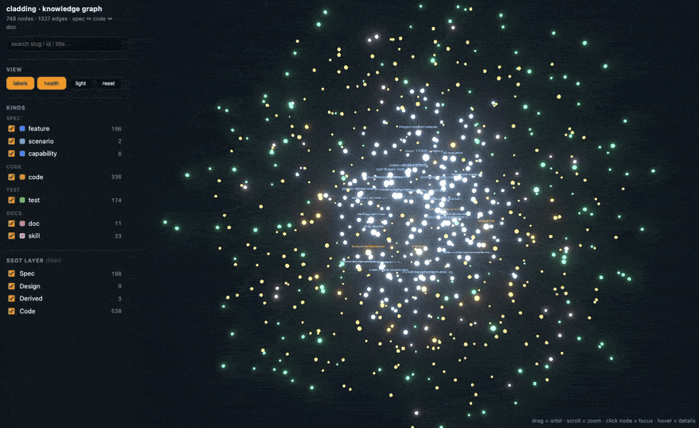

<p align="center">
  <a href="README.md">English</a> · <a href="README.ko.md">한국어</a> · <strong>日本語</strong> · <a href="README.zh.md">中文</a>
</p>

<h1 align="center">cladding</h1>

<p align="center">
  <strong>AI にコーディングを任せるには、組織に三つの条件が要る —<br/>コードを信頼でき、その足跡をたどれ、規模が大きくなっても揺るがないこと。cladding はその三つを築く。</strong><br/>
  その名（外装材）のとおりホスト LLM（Claude Code · Codex · Gemini · Cursor）を包み込む — 作業を <em>始める前</em> に、cladding がプロジェクトの意図を渡し、作業を <em>終えた後</em> に、41 個の検出器と 15 段階のゲートで結果を検証する。
</p>

<p align="center">
  <a href="https://github.com/qwerfunch/ironclad"></a>
  <a href="https://github.com/qwerfunch/ironclad"></a>
  
  
  <a href="LICENSE"></a>
</p>

<div align="center">



</div>

> **このループが狙うのはただ一つ —** AI の *「できました」* を、口先の **主張** から **証明** へと変えることだ。

だから、AI が書いたコードを **人が書いたコードと同じ信頼で** 送り出せる。cladding は **自分自身も cladding で作っている** — 254 個の feature のうち 251 個が同じゲートを通過した、[Ironclad](https://github.com/qwerfunch/ironclad) 標準を L4 で実装した最初の事例だ。

**出荷されたものは記録に残る** — 何を検証したかはコミットされた内容に刻まれ、誰がいつやったかはローカルのセッション台帳に、なぜかは spec に残る。だから引き継ぎもレビューも、掘り起こさずに決定をたどれる。

<!-- ─────────────── What changes ─────────────── -->

## 何が変わるか

同じ状況で、*素の AI コーディング環境* と cladding 環境の振る舞いがどう違うか。

| 状況 | 素の AI コーディング | cladding |
|---|:---|:---|
| **コードが spec から乖離する** | レビューで *気づけば* 直る | 編集直後に自動検知 · 乖離したままでは「完了」が通らない |
| **AI が「できました」と言う** | 言葉を信じるしかない | ゲートが GREEN のときだけ `done` を獲得 |
| **失敗した状態でセッションを終える** | そのまま終了し、次回には忘れられる | 終了を一度止め、修正カードを引き継ぐ |
| **二人が同時に feature を追加する** | merge conflict | hash-8 ID · ファイル分離 → 衝突 0 |
| **AI が書いたコードは誰が検証する？** | 書いた AI が自分で検証する（危うい） | 実装を見ない採点者 + 機械的なゲート |
| **AI ツールを乗り換える** | ツールごとに再設定 | 1 つの spec → 4 つの host へ自動配線 |

<!-- ─────────────── How cladding wraps the host LLM ─────────────── -->

## cladding はホスト LLM をどう包み込むか

**前 — 意図を注入する。** LLM が正しいコンテキストで始められるように:

- **効く意図だけを抽出** — いま扱っている feature の *なぜ*、関連する feature、そして受け入れ基準だけを取り出す（spec 全体をそのまま流し込んだりしない）。
- **プロジェクトマップの注入** — feature がいくつあり、何が進行中で、直近の検証結果はどうか。会話が始まるたびに冒頭で LLM へ渡される <sub>（いまはあなたの目でも確認できる ↓）</sub>。
- **プロジェクトのルールを適用** — チームで合意した禁止パターンと推奨パターンを、毎回の常設指示として渡す。

**後 — 検証する:** 15 段階のゲート、41 個の乖離検出器、そして **実装を見ない採点者** — spec に照らして作業を検査するエージェントで、*実装を読む手段を一切持たない* ため、自分が書いたものにお墨付きを与えることはできない。

<sub>リアルタイム介入（マップ注入 · 即時ブロック · 終了ブロック）は Claude Code ですべて動作する。Codex · Gemini · Cursor では同じ検証を、会話中のツール呼び出しと git · CI のゲートで通す。</sub>

<!-- ─────────────── done is earned ─────────────── -->

## 「done」は宣言ではなく、勝ち取るものだ

AI コーディングの持病は、検証の裏づけなしに *「できました」* と宣言されることだ。cladding では、feature の `status: done` は自分で書き込む値ではなく、**勝ち取る** 値だ。

<div align="center">



</div>

① AI が完了マークを **自分で書き込もう** とすると → **その場でブロック** される（「完了は検証で勝ち取ってください」）。

② AI が完了を **要求** すると → 決定的な 9 段階をすべて回し、**全部が通ったときだけ** done として記録する。一つでも落ちれば自動で巻き戻す — E2E · 証拠の段階は CI の全 15 段階が担う。

③ 通過した瞬間に **検証署名** が残る — 「このコードはこの時点で検証された」というコミット可能な証拠だ。

④ 失敗を残したまま会話を終えようとすると → **一度は押しとどめ**（同じ失敗でもう一度終えようとすると、通すのではなく事実を記録する）、修正カードを次の会話へ引き継ぐ。

限界も包み隠さず開示する: 即時ブロックが見逃す抜け道は存在し、その場合は事後検証（ゲート · 乖離チェック）が捕まえる。即時ブロックが第一の防衛線、事後検証が第二の防衛線であり、どちらも単独では保証にならない。

<!-- ─────────────── Project graph ─────────────── -->

## プロジェクトグラフ — いまは目で見て、問いかけられる <sub>新</sub>

これは cladding が内部に描く **あなたのプロジェクトのグラフ** だ — spec · コード · テスト · ドキュメントが、すべてつながっている。それを、いまは目で見て、問いかけられる。

> **なぜ効くのか — 説明とコードが離れていかない。**
> ドキュメントは時間が経つと嘘をつく — コードは変わるのに、説明はそのまま残るからだ。cladding はその結びつきをコードを読むたびに突き合わせ直し、ずれている間は「完了」を止める。

<div align="center">



</div>

- **見る** — `clad graph serve` を実行すると、プロジェクト全体がブラウザで開く。何が何につながっているか一目でわかる。
- **尋ねる** — *「ここを直したら何が壊れる？」* グラフに尋ねれば、影響が及ぶコードと回すべきテストを教えてくれる — 当て推量ではない。
- **測る** — プロジェクトが大きいほど効く: 何かを直すときに目を通す量が、平均 **4×** 少なくて済む（`clad measure`）。

```bash
clad graph serve                                  # ライブグラフ — localhost:3000、保存すると自動リロード
clad graph export --format html --out graph.html  # または単一のオフラインファイル（.html）に書き出す
```

<sub>どちらも cladding 0.7.0+ が必要。</sub>

<!-- ─────────────── Under the hood ─────────────── -->

## 内部の仕組み

**Spec → Code → Tests** が一つの cycle として回る — spec が *なぜ* を記録し、ゲートが検証し、detector が乖離をせき止める。

<div align="center">


</div>

**Spec — 意図の唯一の源。** 4 階層の単一の真実の源（SSoT）: 意図 (A) → 設計 (B) → コード + attestation (C) → 監査 (D)。**A がすべてに優先する** — spec とコードが食い違えば、間違っているのは *コード* の方だ。feature はそれぞれ 8 文字のハッシュ ID（`F-d86375d8`）を持つ専用ファイルに分かれるので、二人が同時に feature を追加しても衝突しない。→ [4 階層モデル](docs/ssot-model.md) · [ハッシュベースの ID](docs/spec-ids-multi-dev.md)

<div align="center">


</div>

**Gate — 15 段階の Iron Law。** 検査エンジンは一つ、コストで束ねる: commit で 3 段階、push · 完了で 9 段階、CI で 15 段階すべて。違うのは深さだけだ。→ [15 段階の詳細](docs/gate-stages.md)

<div align="center">



</div>

**Detector — 41 個の乖離検出器。** spec · code · test にまたがる、あらゆる方向の乖離を捕まえる: 実装の欠落、テストされていない受け入れ基準、虚偽のステータス、古くなった検証署名、根拠を超えたドキュメントの主張。→ [detector カタログ](src/stages/detectors/README.md)

<!-- ─────────────── Agent-loop verifier ─────────────── -->

## エージェントループの検証役として使う

ループはあなたのものだ — エージェントを動かすハーネスであれ、オーケストレーターであれ。cladding はその内側の **検証役であり状態の層** だ。ループを代わりに回すのではなく、まだ何が間違っていて、いつ止まってよいかをループに伝える。

- **フィードバック信号** — 反復ごとに `clad check --json` を回す。判定は機械可読だ: トップレベルの `anyFailed` と `worst` の深刻度、そして各エントリが `detector`・`severity`・`message` を持つステージ別の `findings[]`。コンソールのテキストを掻き集める必要はなく、そのままループのエラー信号として戻せる。
- **正直な停止** — エージェントの言い分ではなく `clad done` にループを委ねる。strict な pre-push ゲートが GREEN のときだけ feature を `done` に切り替え、そうでなければ巻き戻す。「ループが終わったと言っている」が「ゲートが通した」に変わる。
- **ループの記憶** — ローカルのイベントログ（`.cladding/events.log.jsonl`、gitignore 対象）が、ゲートの実行 · done の試行 · 乖離の発火を反復をまたいで作業記憶として保持する（永続的な記録ではない。5 MB でローテートする）。

正直な線引き: これはループの **停止条件とフィードバック信号** を固くするのであって、モデルのコード品質を上げるわけではない。cladding 自身の A/B 記録がその領収書だ — **ガバナンスは正確性と直交する**。

<!-- ─────────────── Multi-Agent ─────────────── -->

## Multi-Agent — 作る側と検証する側を分ける

**作る** エージェントと **検証する** エージェントを分けてあり、どのエージェントも自分の仕事に自分で承認を与えられない。**blind-author** はさらに一歩進む — テストを書くエージェントには、そもそも *実装を読む手段が与えられていない*（Read/Grep を付与しない）。「実装を見ずに書いた」が約束ではなく構造的な事実になる。この分離は、規制 · 監査の枠組み（EU AI Act · SOX）が求める職務分掌の原則と重なる — それらの精神に合致するという意味であって、認証ではない。

<div align="center">



</div>

<!-- ─────────────── Ecosystem ─────────────── -->

## Ecosystem

cladding は既存の三つのカテゴリの結合点に位置する。

<div align="center">



</div>

- **Spec Kit · OpenSpec · Tessl · Kiro** — *良い spec を書く* のを助けるツール。cladding はその上で、*spec と実際のコードが乖離しないかを、開発ループの中で継続的に突き合わせ続ける*。
- **BMAD · ChatDev · Claude Code Agent Teams** — *複数の AI エージェントに役割を分担させる* システム。cladding のエージェント分業は、その上に *spec · ゲート · 監査記録* まで組み合わせて動く。
- **tdd-guard** — *AI にテストを先に書かせる* ツール。cladding の Unit · Coverage · oracle の各段階が、同じ仕事をより構造的にこなす。
- **OpenHands · Cline · Aider · Goose** — *AI にコードを書かせるランナー*（純粋な実行役）。cladding は、それらのランナーが生み出したコードを *検証し統制する上位レイヤ* だ。

cladding の差別化点は *組み合わせ* にある — 上のカテゴリの核を *一つの検証ループ* に束ねることだ。

<!-- ─────────────── Install ─────────────── -->

## Install

```bash
npm install -g cladding   # cladding CLI をインストール
cd <project>              # プロジェクトへ移動
clad setup                # AI ツールを自動配線（Claude · Codex · Gemini · Cursor）
```

続いて、プロジェクトにつき一度だけ、AI ツールの中から init を呼び出す:

```
[AI ツールの中で] /cladding:init "B2B 決済 SaaS"
```

プロジェクトの `spec.yaml` と関連ドキュメントが作られる。あとはいつも通り開発するだけ — cladding が前 / 後のループを裏で回すので、覚えるコマンドはない。強制力を上げたいときは `clad init --with-hook`（pre-commit + pre-push の git hook）または `clad init --with-ci`（CI ゲートの雛形を生成 — 本当の強制は CI にある）。

| 出発点 | コマンド | 何が起きるか |
|---|---|---|
| **アイデアだけがある** | `/cladding:init "B2B 決済 SaaS を作る"` | LLM がドメインを分析 → spec · ドキュメント · ポリシーを自動生成 + 2〜3 個の追加質問 |
| **企画ドキュメントがある** | `/cladding:init docs/plan.md` | ファイルを読み込み、その内容を intent として使う |
| **既存プロジェクトへ導入する** | `/cladding:init "このプロジェクトに cladding を適用して"` | 既存コードをスキャン → 観察したパターンと intent を結合 |

**host サポート（正直な注記）:** Claude Code は実利用キャンペーン（リアルタイム介入を含む）で全機能を検証済み。Codex · Gemini CLI は配線の自動化 + 基本動作を確認済み。Cursor は配線は自動だが、実利用での検証はまだこれから。→ [セットアップ詳細 · host 配線 · MCP · アップグレード](docs/setup.md)

<!-- ─────────────── Status ─────────────── -->

## Status

| Version | 準拠レベル | Tests | Gate | Features |
|---|---|---|---|---|
| v0.8.3（2026-07） | L4 · [自己申告](https://github.com/qwerfunch/ironclad/blob/main/GOVERNANCE.md) | 2497 / 2497 | 15 段階 · 41 detectors | 254（251 done） |

<sub>234 test files · capability 6 個 · カバレッジ低下は COVERAGE_DROP detector がブロック</sub>

> **Ironclad 1.0 への道** — 1.0 は *独立した二つの実装が L4 準拠フィクスチャを通過してはじめて* 確定する（[GOVERNANCE § 1](https://github.com/qwerfunch/ironclad/blob/main/GOVERNANCE.md)）。cladding はその一つ目だ。

## Docs

- [Why cladding (project context)](docs/project-context.md)
- [4-tier governance model](docs/ssot-model.md)
- [The 15 gate stages](docs/gate-stages.md)
- [Hash-based feature IDs](docs/spec-ids-multi-dev.md)
- [41 detector catalog](src/stages/detectors/README.md)
- [Setup · host wiring · upgrading](docs/setup.md)
- [用語集 (EN · KO)](docs/glossary.md)
- [Governance · roadmap to 1.0](GOVERNANCE.md)

## License

MIT。[LICENSE](LICENSE) · 関連: [Ironclad](https://github.com/qwerfunch/ironclad)（cladding が実装する標準）· [harness-boot](https://github.com/qwerfunch/harness-boot)（seed）。
