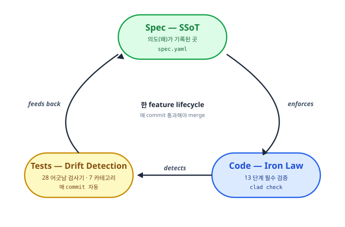
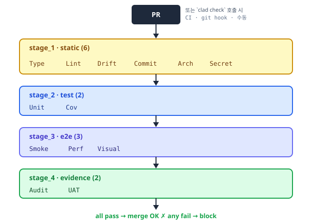
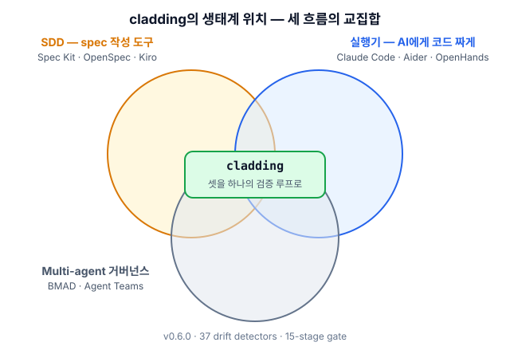

<p align="center">
  
</p>

<p align="center">
  <a href="README.md">English</a> · <strong>한국어</strong>
</p>

<h1 align="center">cladding</h1>

<p align="center">
  <strong>Unified Governance for AI-Coupled Engineering.</strong><br/>
  AI 가 짠 코드도 사람이 짠 코드만큼 검증되도록.
</p>

<p align="center">
  <a href="https://github.com/qwerfunch/ironclad"></a>
  <a href="https://github.com/qwerfunch/ironclad"></a>
  
  
  <a href="LICENSE"></a>
</p>

<p align="center">
  <a href="https://github.com/qwerfunch/ironclad">Ironclad</a> 표준의 공식 reference 구현. AI 코딩 어시스턴트가 짠 코드가 spec 과 어긋나지 않는지 28 개의 검사기와 13 단계 검증 관문이 매 commit 마다 자동으로 대조한다.
</p>

<!-- ─────────────────────────── HERO ─────────────────────────── -->

<table align="center">
<tr>
<td style="text-align:center;width:320px;background:#f1f5f9;padding:32px 24px;border-radius:8px">
<div style="font-size:13px;color:#64748b;letter-spacing:1px;text-transform:uppercase">일반 (vanilla) AI 코딩</div>
<div style="font-size:64px;font-weight:700;color:#94a3b8;line-height:1;margin:12px 0">2/8</div>
<div style="font-size:13px;color:#64748b">함정 포착 · 25%</div>
</td>
<td style="text-align:center;width:320px;background:#dcfce7;padding:32px 24px;border-radius:8px">
<div style="font-size:13px;color:#15803d;letter-spacing:1px;text-transform:uppercase">cladding</div>
<div style="font-size:64px;font-weight:700;color:#16a34a;line-height:1;margin:12px 0">8/8</div>
<div style="font-size:13px;color:#15803d">함정 포착 · 100%</div>
</td>
</tr>
<tr><td colspan="2" align="center"><sub>같은 spec · 같은 모델로 측정 · <a href="docs/benchmarks/event-store-trap-catch.md">event-sourcing store 벤치마크</a></sub></td></tr>
</table>

## 왜 필요한가

<table>
<tr>
<td width="33%" valign="top">

**3개월 뒤 의도 추적 불가**

AI 가 짠 코드의 *왜* 가 코드만 봐서는 안 잡힌다.

→ `spec/features/*.yaml` 이 *왜* 의 영구 기록

✓ **AI 가 시간을 견딘다** — 6개월 뒤에도 AI 가 spec 보고 의도 즉시 파악 (신규 입사자도 같은 진입점)

</td>
<td width="33%" valign="top">

**AI 답이 매번 다름**

같은 spec 으로 짠 코드의 패턴과 구조가 일관성 없다.

→ spec 이 *고정 기준* 으로 각 commit 검증

✓ **엔터프라이즈 채택 가능** — 팀 · PR 간 코드 스타일 · 패턴 일관

</td>
<td width="33%" valign="top">

**AI hallucination**

존재하지 않는 API · 함수 · 옵션을 호출하는 코드 생성.

→ 28 detector + 13 단계 gate 가 매 commit 차단

✓ **production 사고 사전 차단** — CI 가 hallucination 코드를 자동 reject

</td>
</tr>
</table>

## 차이점

같은 문제 상황에서 *일반적인 (vanilla) AI 코딩 환경*과 cladding 환경이 어떻게 다르게 동작하는지.

<table>
<thead>
<tr><th align="left">상황</th><th align="center">일반 AI 코딩</th><th align="center">cladding</th></tr>
</thead>
<tbody>
<tr><td><strong>코드가 spec 과 어긋날 때</strong></td><td align="center" style="color:#64748b">review 에서 <em>발견하면</em> fix</td><td align="center"><strong style="color:#16a34a">매 commit 자동 차단</strong></td></tr>
<tr><td><strong>두 명이 같은 기능 동시에 만들 때</strong></td><td align="center" style="color:#64748b">merge conflict 발생</td><td align="center"><strong style="color:#16a34a">hash ID 로 다른 파일 → 충돌 0</strong></td></tr>
<tr><td><strong>AI 가 짠 코드를 누가 검증?</strong></td><td align="center" style="color:#64748b">작성한 AI 가 자기 검증 (위험)</td><td align="center"><strong style="color:#16a34a">별도 reviewer agent 가 분업 검증</strong></td></tr>
<tr><td><strong>AI 도구 (Claude → Cursor) 바꿀 때</strong></td><td align="center" style="color:#64748b">도구마다 재구성 필요</td><td align="center"><strong style="color:#16a34a">1 spec → 4 host 자동 미러링</strong></td></tr>
<tr><td><strong>spec 의 권위</strong></td><td align="center" style="color:#64748b">AI 가 매번 다르게 해석</td><td align="center"><strong style="color:#16a34a">봉인된 spec 이 단일 기준</strong></td></tr>
</tbody>
</table>

<sub>Hero 의 8/8 vs 2/8 은 초기 벤치마크 (<a href="docs/benchmarks/event-store-trap-catch.md">상세</a>) · 대규모 측정 진행 중.</sub>

## How it works

**Spec → Code → Tests** 가 한 cycle 로 순환한다 — spec 이 *왜* 를 기록하고, Iron Law 가 검증하고, Drift detector 가 어긋남을 차단한다.

<div align="center">



</div>

### 1. Spec — SSoT, 의도의 단일 기준

spec 이 *왜* (무엇을 왜 만드는지) 를 기록하는 곳. 4-tier (A/B/C/D) 단일 진실 출처 (Single Source of Truth) — *의도가 위, 구현물이 아래*.

| Tier | 역할 | 수정 권한 | 권위 |
|---|---|---|---|
| **A — Spec** | 의도 (무엇을 만들까) | 사람이 정의 | 봉인 · LLM 수정 금지 |
| **B — Design** | 설계 (어떻게 만들까) | 사람이 자유 편집 | A 와 일치 검증 |
| **C — Derived** | 구현물 (코드 · 테스트) | LLM · 사람 | 코드 보고 자동 재생성 |
| **D — Audit** | 감사 기록 (무엇이 일어났나) | append-only | 수정 불가 |

**A 가 B 보다 우선** — 코드와 spec 이 다르면 *코드가* 틀린 것. 의도(A)가 변하면 모든 게 흔들리기 때문에 LLM 이 못 건드리도록 봉인.

**샤딩 · multi-dev 안전** — `spec/features/<slug>-<hash6>.yaml` 처럼 *feature 마다 별도 파일* + *6-자리 hash ID* (예: `F-5f6b45`). 두 명이 동시에 새 feature 를 만들어도 *다른 파일·다른 ID* 라 merge conflict 0. 자세히는 [Hash-based feature IDs](docs/spec-ids-multi-dev.md).

<div align="center">


</div>

### 2. Code — Iron Law (필수 통과) gate

모든 변경은 13 단계 gate 를 통과해야 한다 — 보통 CI step · git pre-push hook · `clad check` 수동 호출 어디서든 실행. 각 stage 가 자체 unit test 와 함께 ship 된다.

<div align="center">



</div>

| Stage | 무엇을 검사하나 |
|---|---|
| **1.1 Type · 1.2 Lint** | 타입 오류 · 코드 스타일 |
| **1.3 Drift** | 28 detector 의 spec ↔ 코드 어긋남 |
| **1.4 Commit · 1.5 Arch · 1.6 Secret** | 작업트리 clean · architecture invariant (forbidden import 등) · API 키 노출 |
| **2.1 Unit · 2.2 Cov** | 단위 테스트 통과 · 프로젝트 coverage threshold |
| **3.1 Smoke · 3.2 Perf · 3.3 Visual** | e2e 핵심 기능 동작 · 성능 예산 · UI 시각 회귀 |
| **4.1 Audit · 4.2 UAT** | 모든 AC (acceptance criteria, 수용 기준) 에 증거 1건 이상 · 모든 `status=done` feature 에 증거 1건 이상 |

### 3. Test — 28 개 어긋남 검사기 (drift detector)

spec · code · test 사이 7 카테고리의 어긋남을 자동으로 잡아낸다. 전체 카탈로그: [src/stages/detectors/README.md](src/stages/detectors/README.md).

<table>
<thead>
<tr><th>카테고리</th><th>무엇을 잡나</th><th align="center">수</th><th>대표 detector</th></tr>
</thead>
<tbody>
<tr><td>spec ↔ code drift</td><td>spec 에 있는데 코드에 없거나, 코드에 있는데 spec 에 없음</td><td align="center">6</td><td><code>UNMAPPED_ARTIFACT</code>, <code>MISSING_IMPLEMENTATION</code>, <code>AC_DRIFT</code></td></tr>
<tr><td>code ↔ test</td><td>코드는 있는데 테스트 없음 · 커버리지 부족</td><td align="center">6</td><td><code>MISSING_TESTS</code>, <code>COVERAGE_DROP</code>, <code>HARDCODED_SECRET</code></td></tr>
<tr><td>spec ↔ test</td><td>spec 의 AC 가 테스트로 검증 안 됨</td><td align="center">4</td><td><code>UNTESTED_AC</code>, <code>STATUS_DRIFT</code>, <code>STALE_EVIDENCE</code></td></tr>
<tr><td>spec maintenance</td><td>spec 자체의 위생 (slug 충돌 · ID 중복)</td><td align="center">5</td><td><code>SLUG_CONFLICT</code>, <code>ID_COLLISION</code>, <code>ENRICHMENT_PENDING</code></td></tr>
<tr><td>environment integrity</td><td>빌드 환경 · 메타 파일 무결성</td><td align="center">3</td><td><code>HARNESS_INTEGRITY</code>, <code>META_INTEGRITY</code></td></tr>
<tr><td>architecture · capability</td><td>spec 의 아키텍처 · capability 정의와 코드 불일치</td><td align="center">2</td><td><code>ARCHITECTURE_FROM_SPEC</code>, <code>CAPABILITIES_FEATURE_MAPPING</code></td></tr>
<tr><td>governance · policy</td><td>ai_hints 정책 위반 (예: 금지 패턴 사용)</td><td align="center">2</td><td><code>AI_HINTS_FORBIDDEN_PATTERN</code>, <code>ABSENCE_OF_GOVERNANCE</code></td></tr>
</tbody>
</table>

### 4. Cycle — 한 feature 의 lifecycle

Spec → Code → Test 를 한 cycle 로 묶는 4 step. drift 가 0 이면 merge, 1 이상이면 block.

<div align="center">


</div>

## Multi-Agent Workflow

cladding 은 **5 명의 에이전트가 협업하는 다중 에이전트 (multi-agent) 시스템**. 각 에이전트는 명확한 역할 분담 — **CQS** (Command-Query Separation, *명령하는 역할* 과 *검증하는 역할* 의 분리) — 으로 자기가 짠 작업은 자기가 승인할 수 없다. 규제 · 감사 (EU AI Act · K-AI 기본법 · SOX) 기준에 그대로 매핑된다.

<div align="center">



</div>

## Ecosystem

기존 세 카테고리의 결합부에 cladding 이 있다.

<div align="center">



</div>

### 인접 도구와의 차이

- **Spec Kit · OpenSpec · Tessl · Kiro** — *spec 을 잘 쓰게* 도와주는 도구. cladding 은 거기에 더해 *그 spec 과 실제 코드가 어긋나지 않는지 매 commit 자동 검사* 한다.
- **BMAD · ChatDev · Claude Code Agent Teams** — *여러 AI 에이전트가 역할을 나눠 협업하는 시스템*. cladding 의 5 에이전트는 그 위에 *spec · 코드 · 감사 기록* 까지 결합해 동작한다.
- **tdd-guard** — *AI 가 테스트를 먼저 쓰도록 강제* 하는 도구. cladding 의 13 단계 검사 중 Unit · Coverage 항목이 같은 일을 한다.
- **OpenHands · Cline · Aider · Goose** — *AI 에게 코드를 짜게 시키는 실행기*. cladding 은 그 실행기가 짠 코드를 *검증 · 통제하는 상위 레이어* 다.

cladding 의 차별점은 *결합* — 위 네 카테고리의 핵심을 *하나의 검증 흐름* 으로 묶는 것.

## Install

cladding 은 두 가지 경로로 시작할 수 있다 — 어느 쪽이든 *같은 spec · 같은 정책 · 같은 검증 흐름* 에 도착한다.

### 방법 1 — 마켓플레이스 (가장 빠름)

Claude Code · Codex CLI · Gemini CLI 의 마켓플레이스에서 cladding 을 설치한 뒤, AI 에게 한 줄 명령:

```
/cladding init "B2B 결제 SaaS"
```

AI 가 그 자리에서 spec · 4-tier 문서 · 정책을 자동으로 채운다. 별도의 npm 설치 불필요.

### 방법 2 — npm (터미널 · CI · AI 도구가 없는 환경)

```bash
npm install -g cladding            # binary 만, $HOME 영향 0
clad setup                          # 감지된 AI 도구만 wire (Claude / Codex / Gemini)
clad init "B2B 결제 SaaS"          # 프로젝트 안에서 spec 생성
clad check                          # 13 단계 Iron Law gate 실행
```

`clad setup` 은 *감지된 host* 만 wire — 사용 안 하는 도구는 건너뛴다:

| 호스트 (감지 시) | wire 위치 |
|---|---|
| Claude Code (`~/.claude/`) | `~/.claude/plugins/cladding` |
| Codex CLI skills (`~/.agents/`) | `~/.agents/skills/cladding-*` |
| Codex CLI MCP 서버 (`~/.codex/`) | `~/.codex/config.toml` 의 `[mcp_servers.cladding]` |
| Gemini CLI (`~/.gemini/`) | `~/.gemini/extensions/cladding` |

`clad setup` 은 idempotent — 한 명령이 6 시나리오 처리: 최초 wire · 업데이트 · delta wire (새 AI 도구 추가 후) · repair (symlink 삭제됨) · no-op · conflict 감지. cladding 업그레이드 시나 새 AI 도구 설치 후 언제든 재실행 안전.

> `npm install -g cladding` 은 **postinstall 훅 없음** — install 은 순수 binary 배치만. host channel wire 는 `clad setup` 으로 명시. (마켓플레이스 path 사용자는 불필요 — 매니페스트 자체가 wire.)

### 세 가지 init 시나리오

`clad init` 은 자연어 intent 를 받아 *상황에 맞는 path* 를 자동 선택한다. 같은 명령, 세 가지 시작점.

| 시작 상황 | 명령 (npm 기준) | 무엇이 일어나는가 |
|---|---|---|
| **아이디어만 있을 때** | `clad init "B2B 결제 SaaS 만들거야"` | LLM 이 도메인 분석 → spec · 문서 · 정책 자동 생성 + 2–3 가지 후속 질문 출력 |
| **기획 문서가 있을 때** | `clad init docs/plan.md` | cladding 이 파일 경로를 인식 → 내용을 자동 로드해서 intent 로 사용 (절대/상대 경로 모두 지원) |
| **기존 프로젝트 도입** | `clad init "이 프로젝트에 cladding 적용해줘"` | 기존 코드 자동 스캔 (≥3 source files) → 관찰한 패턴 + intent 결합 |

> 마켓플레이스 (Claude Code · Codex CLI · Gemini CLI) 에서는 `/cladding init "..."` 형식으로 동일하게 사용 — 자유 텍스트도, `/cladding init docs/plan.md` 같은 경로도 같게 받는다.

### init 한 번이면 끝

cladding 의 목표는 *spec ↔ 코드 어긋남을 막는 인프라가 되는 것* — init 이후로는 평소처럼 개발하면 된다. AI 도구가 spec 을 참조하며 코드를 짜고, `clad check` 가 CI · pre-commit hook 에서 자동으로 돌아 어긋남이 있으면 차단한다. 추가 수동 명령 불필요.

## Status

<table style="margin:0 auto;border:none">
<tr style="border:none">
<td style="text-align:center;width:140px;background:#f8fafc;padding:18px 10px;border-radius:8px;border:none">
<div style="font-size:11px;color:#64748b;letter-spacing:1.5px;text-transform:uppercase;font-weight:600">version</div>
<div style="font-size:24px;font-weight:800;color:#0f172a;margin:8px 0;letter-spacing:-0.5px">v0.3.60</div>
<div style="font-size:11px;color:#64748b">2026-05</div>
</td>
<td style="text-align:center;width:140px;background:#dcfce7;padding:18px 10px;border-radius:8px;border:none">
<div style="font-size:11px;color:#15803d;letter-spacing:1.5px;text-transform:uppercase;font-weight:600">준수 등급</div>
<div style="font-size:24px;font-weight:800;color:#16a34a;margin:8px 0;letter-spacing:-0.5px">L4</div>
<div style="font-size:11px;color:#15803d">최고 · 자가 선언</div>
</td>
<td style="text-align:center;width:140px;background:#f8fafc;padding:18px 10px;border-radius:8px;border:none">
<div style="font-size:11px;color:#64748b;letter-spacing:1.5px;text-transform:uppercase;font-weight:600">tests</div>
<div style="font-size:24px;font-weight:800;color:#0f172a;margin:8px 0;letter-spacing:-0.5px">954<span style="font-size:16px;color:#94a3b8">/954</span></div>
<div style="font-size:11px;color:#64748b">all pass</div>
</td>
<td style="text-align:center;width:140px;background:#f8fafc;padding:18px 10px;border-radius:8px;border:none">
<div style="font-size:11px;color:#64748b;letter-spacing:1.5px;text-transform:uppercase;font-weight:600">coverage</div>
<div style="font-size:24px;font-weight:800;color:#0f172a;margin:8px 0;letter-spacing:-0.5px">93.89<span style="font-size:16px;color:#94a3b8">%+</span></div>
<div style="font-size:11px;color:#64748b">enforced</div>
</td>
<td style="text-align:center;width:140px;background:#f8fafc;padding:18px 10px;border-radius:8px;border:none">
<div style="font-size:11px;color:#64748b;letter-spacing:1.5px;text-transform:uppercase;font-weight:600">features</div>
<div style="font-size:24px;font-weight:800;color:#0f172a;margin:8px 0;letter-spacing:-0.5px">135</div>
<div style="font-size:11px;color:#64748b">spec 정의</div>
</td>
</tr>
</table>

<sub>101 test files · Claude Code · OpenAI Codex · Gemini CLI 마켓플레이스 설치 가능.</sub>

> **Ironclad 1.0 까지의 길** — 1.0 은 *독립적인 두 개의 구현이 L4 검증 셋을 통과해야* 잠긴다 ([GOVERNANCE § 1](https://github.com/qwerfunch/ironclad/blob/main/GOVERNANCE.md)). cladding 이 첫 번째.

## Docs

- [Why cladding (project context)](docs/project-context.md)
- [4-tier governance model](docs/ssot-model.md)
- [Hash-based feature ID](docs/spec-ids-multi-dev.md)
- [28 detector catalog](src/stages/detectors/README.md)
- [Benchmark — event store trap catch](docs/benchmarks/event-store-trap-catch.md)
- [A/B evaluation cases](docs/ab-evaluation/)
- [Governance · roadmap to 1.0](GOVERNANCE.md)

## License

MIT. [LICENSE](LICENSE) · 관련: [Ironclad](https://github.com/qwerfunch/ironclad) (구현 대상 표준) · [harness-boot](https://github.com/qwerfunch/harness-boot) (seed).
