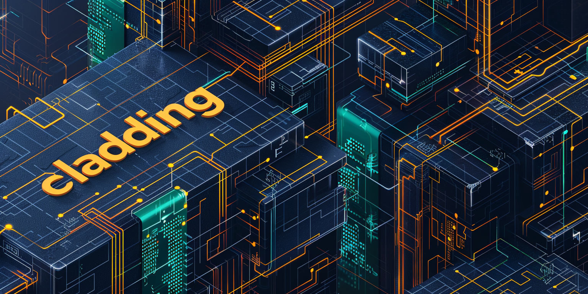
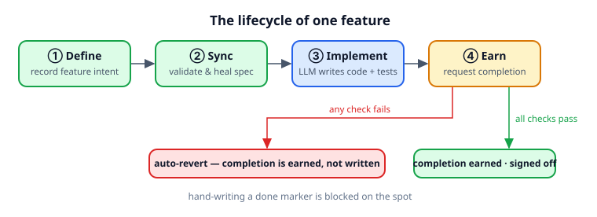
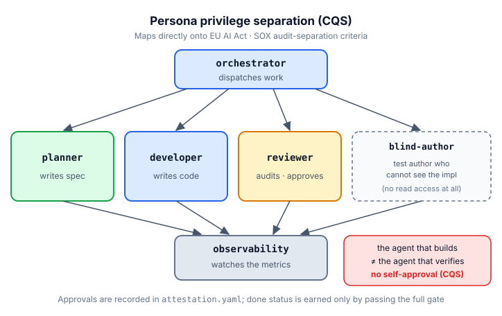
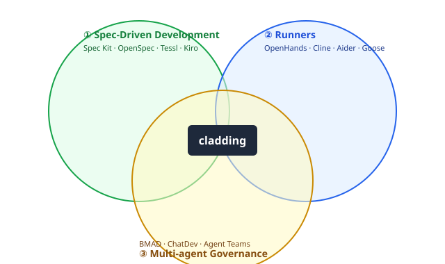

<p align="center">
  
</p>

<p align="center">
  <strong>English</strong> · <a href="README.ko.md">한국어</a>
</p>

<h1 align="center">cladding</h1>

<p align="center">
  <strong>Unified Governance for AI-Coupled Engineering.</strong><br/>
  AI-generated code, held to the same bar as human code.
</p>

<p align="center">
  <a href="https://github.com/qwerfunch/ironclad"></a>
  <a href="https://github.com/qwerfunch/ironclad"></a>
  
  
  <a href="LICENSE"></a>
</p>

<p align="center">
  Reference implementation of the <a href="https://github.com/qwerfunch/ironclad">Ironclad</a> standard. 34 detectors and a 13-stage gate verify, on every commit, that the code your AI assistant wrote still matches the spec.
</p>

<!-- ─────────────── HERO ─────────────── -->

<table align="center">
<tr>
<td style="text-align:center;width:320px;background:#f1f5f9;padding:32px 24px;border-radius:8px">
<div style="font-size:13px;color:#64748b;letter-spacing:1px;text-transform:uppercase">Vanilla AI coding</div>
<div style="font-size:64px;font-weight:700;color:#94a3b8;line-height:1;margin:12px 0">2/8</div>
<div style="font-size:13px;color:#64748b">traps caught · 25%</div>
</td>
<td style="text-align:center;width:320px;background:#dcfce7;padding:32px 24px;border-radius:8px">
<div style="font-size:13px;color:#15803d;letter-spacing:1px;text-transform:uppercase">cladding</div>
<div style="font-size:64px;font-weight:700;color:#16a34a;line-height:1;margin:12px 0">8/8</div>
<div style="font-size:13px;color:#15803d">traps caught · 100%</div>
</td>
</tr>
<tr><td colspan="2" align="center"><sub>Same spec · same model · <a href="docs/benchmarks/event-store-trap-catch.md">event-sourcing store benchmark</a></sub></td></tr>
</table>

<!-- ─────────────── Quick start ─────────────── -->
## Quick start

```bash
npm install -g cladding   # global CLI
clad setup                # global wiring — Claude / Codex / Gemini / Cursor
# then inside your project, from your AI tool:
/cladding:init "your project intent"
```

[Full install options, marketplace route, and host channel table ↓](#install)

## Why

<table>
<tr>
<td width="33%" valign="top">

**The *why* fades after 3 months**

The reason an AI assistant wrote code a certain way doesn't survive in the code alone.

→ `spec/features/*.yaml` becomes the permanent record of *why*.

✓ **AI context survives time** — six months later, the AI reconstructs intent straight from the spec (new hires get the same entry point).

</td>
<td width="33%" valign="top">

**AI gives a different answer each time**

The same spec produces code with inconsistent patterns and structure.

→ The spec becomes the *fixed reference* against which every commit is checked.

✓ **Enterprise-ready consistency** — code style and patterns stay aligned across teams and PRs.

</td>
<td width="33%" valign="top">

**AI hallucination**

Generated code calls APIs, functions, or options that don't exist.

→ 34 detectors and a 13-stage gate block hallucinated code on every commit.

✓ **Production incidents prevented up front** — CI auto-rejects hallucinated code before it merges.

</td>
</tr>
</table>

## What you get

How a *vanilla AI coding environment* and a cladding environment behave when the same situation comes up.

<table>
<thead>
<tr><th>Situation</th><th align="center">Vanilla AI coding</th><th align="center">cladding</th></tr>
</thead>
<tbody>
<tr><td><strong>Code drifts from spec</strong></td><td align="center" style="color:#64748b">fixed if a reviewer notices</td><td align="center"><strong style="color:#16a34a">auto-blocked on every commit</strong></td></tr>
<tr><td><strong>Two devs build the same feature in parallel</strong></td><td align="center" style="color:#64748b">merge conflicts</td><td align="center"><strong style="color:#16a34a">hash-based IDs route to separate files → 0 conflicts</strong></td></tr>
<tr><td><strong>Who verifies AI-written code?</strong></td><td align="center" style="color:#64748b">the AI that wrote it (risky)</td><td align="center"><strong style="color:#16a34a">a separate reviewer agent — duties split</strong></td></tr>
<tr><td><strong>Switching AI tools (Claude → Cursor)</strong></td><td align="center" style="color:#64748b">reconfigure per tool</td><td align="center"><strong style="color:#16a34a">one spec → mirrored across 4 hosts</strong></td></tr>
<tr><td><strong>Spec authority</strong></td><td align="center" style="color:#64748b">the AI reinterprets it each time</td><td align="center"><strong style="color:#16a34a">the sealed spec is the single source of truth</strong></td></tr>
</tbody>
</table>

<p style="text-align: center; font-size: 13px; color: #64748b; margin-top: 8px;">
The hero's 8/8 vs 2/8 is an early benchmark (<a href="docs/benchmarks/event-store-trap-catch.md">details</a>) · larger-scale measurements are in progress.
</p>

<!-- ─────────────── How it works ─────────────── -->
## How it works

**Spec → Code → Tests** runs as a single cycle — the spec captures the *why*, Iron Law verifies the implementation, and Drift Detection blocks anything that no longer matches.

<div align="center">



</div>

### 1. Spec — SSoT, single source of intent

The spec is where the *why* (what we're building and why) lives. A 4-tier (A/B/C/D) Single Source of Truth — *intent on top, implementation below*.

| Tier | Role | Who edits | Authority |
|---|---|---|---|
| **A — Spec** | intent (what to build) | humans only | sealed · LLMs cannot edit |
| **B — Design** | design (how to build it) | humans freely | checked against A |
| **C — Derived** | implementation (code · tests) | LLMs and humans | regenerated by reading the code |
| **D — Audit** | audit log (what actually happened) | append-only | immutable |

**A outranks B** — if code and spec disagree, *the code is wrong*. The spec is sealed because changing the *why* shakes everything downstream, so LLMs are kept out.

**Sharded · multi-dev safe** — `spec/features/<slug>-<hash6>.yaml` puts *each feature in its own file* with a *6-char hash ID* (e.g. `F-5f6b45`). Two devs creating new features at the same time land in *different files with different IDs* — zero merge conflicts. Details: [Hash-based feature IDs](docs/spec-ids-multi-dev.md).

<div align="center">


</div>

### 2. Code — Iron Law (required) gate

Every change has to clear all 13 stages — typically called from CI, a git pre-push hook, or manual `clad check`. Each stage ships with its own unit tests.

<div align="center">



</div>

| Stage | What it checks |
|---|---|
| **1.1 Type · 1.2 Lint** | type errors · code style |
| **1.3 Drift** | spec ↔ code mismatches across 34 detectors |
| **1.4 Commit · 1.5 Arch · 1.6 Secret** | clean working tree · architecture invariants (forbidden imports, etc.) · leaked API keys |
| **2.1 Unit · 2.2 Cov** | unit tests pass · project coverage threshold |
| **3.1 Smoke · 3.2 Perf · 3.3 Visual** | end-to-end critical paths · performance budgets · visual regression |
| **4.1 Audit · 4.2 UAT** | every AC (acceptance criteria) has at least one piece of evidence · every `status=done` feature has at least one piece of evidence |

### 3. Tests — 34 drift detectors

Seven categories of mismatch across spec · code · test, all caught automatically. Full catalog: [src/stages/detectors/README.md](src/stages/detectors/README.md).

<table>
<thead>
<tr><th>Category</th><th>What it catches</th><th align="center">Count</th><th>Representative detectors</th></tr>
</thead>
<tbody>
<tr><td>spec ↔ code drift</td><td>something in the spec missing from code, or in code with nothing in the spec</td><td align="center">7</td><td><code>UNMAPPED_ARTIFACT</code>, <code>MISSING_IMPLEMENTATION</code>, <code>AC_DRIFT</code>, <code>PLANNED_BACKLOG</code></td></tr>
<tr><td>code ↔ test</td><td>code without tests · coverage falling below threshold</td><td align="center">6</td><td><code>MISSING_TESTS</code>, <code>COVERAGE_DROP</code>, <code>HARDCODED_SECRET</code></td></tr>
<tr><td>spec ↔ test</td><td>an AC in the spec that no test actually verifies</td><td align="center">5</td><td><code>UNTESTED_AC</code>, <code>STATUS_DRIFT</code>, <code>SCENARIO_COVERAGE</code></td></tr>
<tr><td>spec maintenance</td><td>spec hygiene — slug collisions, ID duplicates, dependency cycles</td><td align="center">6</td><td><code>SLUG_CONFLICT</code>, <code>ID_COLLISION</code>, <code>INVENTORY_DRIFT</code>, <code>DEPENDENCY_CYCLE</code></td></tr>
<tr><td>environment integrity</td><td>build environment and meta-file integrity</td><td align="center">3</td><td><code>HARNESS_INTEGRITY</code>, <code>META_INTEGRITY</code></td></tr>
<tr><td>architecture · capability</td><td>code that breaks the architecture or capability shape declared in the spec</td><td align="center">2</td><td><code>ARCHITECTURE_FROM_SPEC</code>, <code>CAPABILITIES_FEATURE_MAPPING</code></td></tr>
<tr><td>governance · policy</td><td>code that breaks an `ai_hints` policy, or a hollow / unrefined governance tier</td><td align="center">4</td><td><code>AI_HINTS_FORBIDDEN_PATTERN</code>, <code>HOLLOW_GOVERNANCE</code>, <code>PROJECT_CONTEXT_DRIFT</code></td></tr>
</tbody>
</table>

### 4. Cycle — one feature's lifecycle

The 4 steps that wrap Spec → Code → Test into a single cycle. Merge if drift is 0, block otherwise.

<div align="center">



</div>

## Multi-Agent Workflow

cladding is a **5-agent system** working in concert. The agents that *build* are kept separate from the agents that *verify* — so no agent ever signs off on its own work. That split maps cleanly to compliance regimes (EU AI Act · K-AI Framework · SOX).

<div align="center">



</div>

## Ecosystem

cladding sits at the intersection of three existing categories.

<div align="center">



</div>

### How cladding differs from the neighbors

- **Spec Kit · OpenSpec · Tessl · Kiro** help you *write a good spec*. cladding goes further — it *verifies on every commit* that the code still matches that spec.
- **BMAD · ChatDev · Claude Code Agent Teams** are about splitting work across multiple AI agents. cladding's 5 agents take that further by tying spec, code, and audit log into the same loop.
- **tdd-guard** forces test-first development. That's roughly what the Unit · Coverage stages do inside cladding's 13-stage gate.
- **OpenHands · Cline · Aider · Goose** are *runners* — they tell the AI to write code. cladding is the *governance layer* that verifies and controls what those runners produce.

cladding's edge is the *combination* — it folds the strongest parts of all four categories into one verification loop.

<!-- ─────────────── Install ─────────────── -->
## Install

Two steps: install the infrastructure, then create the project spec.

### Step 1 — Install the infrastructure

Pick the route that fits how you work — both land in the same place:

**(a) npm** — for terminal / CI users

```bash
npm install -g cladding   # install the cladding CLI (global)
clad setup                # connect your AI tools (global — Claude / Codex / Gemini / Cursor)
cd <project>              # for the next step (clad setup itself is project-agnostic)
```

**(b) Marketplace** — for AI-tool plugin users

1. Open the plugin marketplace inside your AI tool (Claude Code · Codex CLI · Gemini CLI)
2. Search for **cladding** and install it
3. No `clad setup` needed — the plugin manifest wires everything

<details>
<summary>Where <code>clad setup</code> connects (5 host channels)</summary>

| Host (when detected) | Wired location | Auto-activation |
|---|---|---|
| Claude Code (`~/.claude/`) | `~/.claude/plugins/cladding` | `claude plugin marketplace add` + `claude plugin install claude-code@cladding` |
| Codex CLI skills (`~/.agents/`) | `~/.agents/skills/cladding-*` | (auto on Codex restart) |
| Codex CLI MCP server (`~/.codex/`) | `[mcp_servers.cladding]` in `~/.codex/config.toml` | (TOML entry itself) |
| Gemini CLI (`~/.gemini/`) | `~/.gemini/extensions/cladding` | `gemini extensions link` |
| Cursor (`~/.cursor/`) | `mcpServers.cladding` in `~/.cursor/mcp.json` | (JSON entry itself) |

`clad setup` invokes the per-host activation commands automatically when `claude` / `gemini` binaries are on PATH. Safe to re-run after a cladding upgrade or after installing another AI tool.

> **About the MCP server.** Every host gets cladding wired as an MCP server — only the wire *location* differs. Claude Code and Gemini CLI auto-start it through the plugin/extension manifest's `mcpServers` field; Codex through `~/.codex/config.toml` `[mcp_servers.cladding]`; Cursor through `~/.cursor/mcp.json`. You never invoke MCP directly — no `/mcp` slash, no manual server-connect step. The AI in each host calls cladding's tools (`clad_create_feature`, etc.) in response to **natural-language requests**; you keep typing `/cladding:init` plus normal chat.

> **Benchmark.** v0.4.0 measurements show ~60% consistency improvement and ~50% LOC reduction vs unguided AI coding on a fixed task, with 100% drift detection across a 5-iteration dev cycle. Full methodology and honest caveats (some of the consistency gain is the "more-specific-prompt" effect, not exclusively cladding) in [`docs/benchmarks/v0.4.0-consistency-bench.md`](docs/benchmarks/v0.4.0-consistency-bench.md).
</details>

### Step 2 — Init (create the project spec)

Inside your project, run it once from your AI tool:

```
[inside your AI tool] /cladding:init "B2B payment SaaS"
```

This creates your project's `spec.yaml` and its supporting docs — one time per project.

### Three init scenarios

`/cladding:init` takes a natural-language intent and picks the right path on its own. Same command, three starting points.

| Starting point | Command | What happens |
|---|---|---|
| **An idea, nothing else** | `/cladding:init "I want to build a B2B payment SaaS"` | LLM infers the domain → spec · docs · policies generated, with 2–3 follow-up questions printed |
| **A planning doc** | `/cladding:init docs/plan.md` | cladding detects the file path, loads its contents, and uses them as the intent (absolute and relative paths both work) |
| **Adopting into an existing project** | `/cladding:init "apply cladding to this project"` | scans the existing code (≥3 source files trigger it) → observed patterns are merged with the intent |

### Init once, then carry on

Run init once and you're set — after that, just keep coding. cladding works in the background to keep your code and spec in sync, so there are no extra commands to remember.

### Upgrading

```
npm update -g cladding     # 1. install the new cladding (marketplace: also `claude plugin update`)
cd <your project>          # 2. once per project
clad update                # 3. bring this project in line with the new version
```

After upgrading, run `clad update` once in each project. It never changes your code, `spec.yaml`, or docs, so it's always safe — and if the newer version is stricter, it just **points that out** (it won't block or fix anything).

<!-- ─────────────── Status ─────────────── -->
## Status

<table style="margin:0 auto;border:none">
<tr style="border:none">
<td style="text-align:center;width:140px;background:#f8fafc;padding:18px 10px;border-radius:8px;border:none">
<div style="font-size:11px;color:#64748b;letter-spacing:1.5px;text-transform:uppercase;font-weight:600">version</div>
<div style="font-size:24px;font-weight:800;color:#0f172a;margin:8px 0;letter-spacing:-0.5px">v0.5.0</div>
<div style="font-size:11px;color:#64748b">2026-06</div>
</td>
<td style="text-align:center;width:140px;background:#dcfce7;padding:18px 10px;border-radius:8px;border:none">
<div style="font-size:11px;color:#15803d;letter-spacing:1.5px;text-transform:uppercase;font-weight:600">conformance</div>
<div style="font-size:24px;font-weight:800;color:#16a34a;margin:8px 0;letter-spacing:-0.5px">L4</div>
<div style="font-size:11px;color:#15803d">top tier · self-declared</div>
</td>
<td style="text-align:center;width:140px;background:#f8fafc;padding:18px 10px;border-radius:8px;border:none">
<div style="font-size:11px;color:#64748b;letter-spacing:1.5px;text-transform:uppercase;font-weight:600">tests</div>
<div style="font-size:24px;font-weight:800;color:#0f172a;margin:8px 0;letter-spacing:-0.5px">1105<span style="font-size:16px;color:#94a3b8">/1105</span></div>
<div style="font-size:11px;color:#64748b">all pass</div>
</td>
<td style="text-align:center;width:140px;background:#f8fafc;padding:18px 10px;border-radius:8px;border:none">
<div style="font-size:11px;color:#64748b;letter-spacing:1.5px;text-transform:uppercase;font-weight:600">coverage</div>
<div style="font-size:24px;font-weight:800;color:#0f172a;margin:8px 0;letter-spacing:-0.5px">93.89<span style="font-size:16px;color:#94a3b8">%+</span></div>
<div style="font-size:11px;color:#64748b">enforced</div>
</td>
<td style="text-align:center;width:140px;background:#f8fafc;padding:18px 10px;border-radius:8px;border:none">
<div style="font-size:11px;color:#64748b;letter-spacing:1.5px;text-transform:uppercase;font-weight:600">features</div>
<div style="font-size:24px;font-weight:800;color:#0f172a;margin:8px 0;letter-spacing:-0.5px">148</div>
<div style="font-size:11px;color:#64748b">spec'd</div>
</td>
</tr>
</table>

<sub>112 test files · installable from the Claude Code · OpenAI Codex · Gemini CLI marketplaces.</sub>

> **Road to Ironclad 1.0** — 1.0 locks when *two independent implementations pass the L4 conformance fixtures* ([GOVERNANCE § 1](https://github.com/qwerfunch/ironclad/blob/main/GOVERNANCE.md)). cladding is the first one.

## Docs

- [Why cladding (project context)](docs/project-context.md)
- [4-tier governance model](docs/ssot-model.md)
- [Hash-based feature IDs](docs/spec-ids-multi-dev.md)
- [34 detector catalog](src/stages/detectors/README.md)
- [Benchmark — event store trap catch](docs/benchmarks/event-store-trap-catch.md)
- [A/B evaluation cases](docs/ab-evaluation/)
- [Governance · roadmap to 1.0](GOVERNANCE.md)

## License

MIT. [LICENSE](LICENSE) · Related: [Ironclad](https://github.com/qwerfunch/ironclad) (the standard cladding implements) · [harness-boot](https://github.com/qwerfunch/harness-boot) (the seed project).
