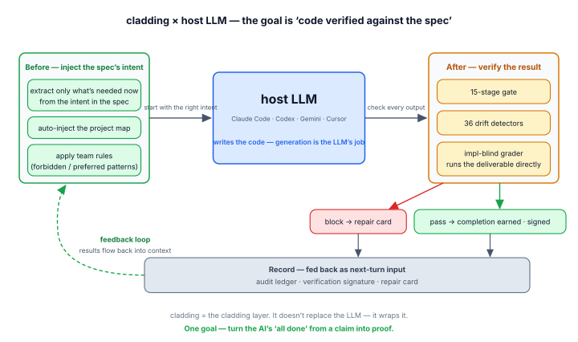

<p align="center">
  <strong>English</strong> · <a href="README.ko.md">한국어</a> · <a href="README.ja.md">日本語</a> · <a href="README.zh.md">中文</a>
</p>

<h1 align="center">cladding</h1>

<p align="center">
  <strong>To trust AI with coding, an organization needs three things — that the code can be trusted,<br/>that it's traced, and that it holds up as you scale. cladding builds those three.</strong><br/>
  True to its name (cladding = the outer layer), it wraps your host LLM (Claude Code · Codex · Gemini · Cursor): <em>before</em> it starts, cladding feeds it the project's intent; <em>after</em> it finishes, cladding verifies the result with 41 detectors and a 15-stage gate.
</p>

<p align="center">
  <a href="https://github.com/qwerfunch/ironclad"></a>
  <a href="https://github.com/qwerfunch/ironclad"></a>
  
  
  <a href="LICENSE"></a>
</p>

<div align="center">



</div>

> **This loop is after one thing —** turning the AI's *"it's done"* from a **claim** into a **proof**.

So you can ship AI-written code with **the same trust as human-written code** — the three things a team needs to hand coding to AI:

- **Trusted** — only code that cleared every check is recognized as `done`; an "it's done" you can't verify never passes.
- **Traced** — **What shipped is on the record**: what was verified is stamped into committed content, who and when land in the local session ledger, and the why lives in the spec — so handoff and review skip the archaeology.
- **Scales** — the spec is the shared baseline, so as the team and the number of AIs grow, conflicts and drift are blocked automatically.

cladding builds **itself** with cladding too — 251 of its 254 features cleared this same gate, the first L4 implementation of the [Ironclad](https://github.com/qwerfunch/ironclad) standard.

<!-- ─────────────── What changes ─────────────── -->

## What changes

The same situation, in a *vanilla AI setup* and in cladding.

| Situation | Vanilla AI coding | cladding |
|---|:---|:---|
| **Code drifts from the spec** | fixed *if* a reviewer notices | auto-detected right after the edit · "done" can't pass while it's drifting |
| **The AI says "it's done"** | you take its word | `done` earned only when the gate is GREEN |
| **Ending a session in a failing state** | exits as-is, forgotten next time | the exit is blocked once, the repair card handed off |
| **Two devs add a feature at the same time** | merge conflict | hash-8 IDs · separate files → 0 conflicts |
| **Who verifies the AI-written code?** | the AI that wrote it self-certifies (risky) | an implementation-blind grader + the mechanical gate |
| **Switching AI tools** | reconfigure per tool | one spec → 4 hosts wired automatically |

## Who it's for

- **Solo, running an agent loop** — cladding is the honest stop-condition and feedback signal your loop reads (see [agent-loop verifier](#using-cladding-as-your-agent-loops-verifier)).
- **A team adding AI contributors** — one spec is the shared baseline, so drift and merge conflicts are blocked automatically as you add people and models.
- **An org that needs a verifiable record** — every `done` carries a committable verify signature, and the why behind each decision lives in the spec.

<!-- ─────────────── How cladding wraps the host LLM ─────────────── -->

## How cladding wraps your host LLM

**Before — inject the intent**, so the LLM starts with the right context:

- **Only the intent that matters** — the *why* of the feature at hand, its related features, and its acceptance criteria (never the whole spec).
- **Project map injected** — feature counts, what's in progress, and the last verification result, handed over at the start of every conversation <sub>(and now you can see it too ↓)</sub>.
- **Team rules applied** — the forbidden and preferred patterns you agreed on, as standing instructions every time.

**After — verify the result:** the 15-stage gate, 41 drift detectors, and an **implementation-blind grader** — an agent that checks the work against the spec *with no tool to read the implementation*, so it can't rubber-stamp what it wrote.

<sub>Real-time intervention (map injection · instant block · stop-block) runs fully on Claude Code. On Codex · Gemini · Cursor the same verification runs through in-conversation tool calls plus the git · CI gate.</sub>

<!-- ─────────────── done is earned ─────────────── -->

## "done" is earned, not declared

The chronic disease of AI coding is *"it's done"* declared with nothing behind it. In cladding, `status: done` is not a value you write — it's a value you **earn**.

<div align="center">


</div>

1. Try to **write the completion mark yourself** → **blocked on the spot** ("earn it by verifying it").
2. **Request** completion → all 9 deterministic stages run; recorded as done **only if every one passes**, else it auto-reverts (the E2E · evidence stages run in CI's full 15).
3. The moment it passes, a **verification signature** is committed — proof that "this code was verified at this point."
4. Try to **end a session on a failure** → **blocked once** (end again on the same failure and it records the fact rather than letting it through), and the repair card carries into the next conversation.

Stated plainly: bypass paths exist that the instant block can't see; those are caught by the after-the-fact gate. Instant block is the first line of defense, the gate the second — neither is a standalone guarantee.

<!-- ─────────────── Project graph ─────────────── -->

## Project graph — see it and ask it <sub>new</sub>

This is cladding's **internal graph of your project** — spec · code · tests · docs, all connected. Now you can see it and ask it.

> **Why it matters — docs and code don't drift apart.** Docs lie as time passes: the code changes, the description doesn't. cladding re-checks that link every time it reads the code, and blocks "done" while the two are out of sync.

<div align="center">


</div>

<sub>Blue = spec (center) · orange = code · green = tests · pink = docs; the more a node connects, the larger it grows and the more it pulls toward the center.</sub>

- **See** — run `clad graph serve` and the whole project opens in your browser; what connects to what, at a glance.
- **Ask** — *"what breaks if I change this?"* The graph answers with the affected code and the tests to run — it doesn't guess.
- **Measure** — the bigger the project, the more it saves: on average **4× less** to read when fixing something (`clad measure`).

```bash
clad graph serve                                  # live graph — localhost:3000, auto-reloads on save
clad graph export --format html --out graph.html  # or a single offline .html file
```

<sub>Requires cladding 0.7.0+.</sub>

<!-- ─────────────── Under the hood ─────────────── -->

## Under the hood

**Spec → Code → Tests** as one cycle — the spec records the *why*, the gate verifies, the detectors block drift.

<div align="center">


</div>

**Spec — the single source of intent.** A 4-tier source of truth, top to bottom:

| Tier | Holds | Written by | Authority |
|---|---|---|---|
| **A · Spec** | intent (what · why) | humans set the intent → the LLM writes it in EARS | sealed · no change without human sign-off · outranks all |
| **B · Design** | design (how) | humans steer → the LLM writes | checked against A |
| **C · Derived** | code · tests + **attestation** (the verify signature) | the LLM writes | auto-regenerated from the code |
| **D · Audit** | what actually happened | auto-recorded, append-only | local |

**A outranks all** — if the spec and the code disagree, the *code* is what's wrong. Each feature is its own sharded file with an 8-char hash ID, so two devs adding features at once never collide. A feature reads like this — intent as a testable acceptance criterion, in EARS form:

```yaml
# spec/features/checkout-a1b2c3d4.yaml
id: F-a1b2c3d4
slug: checkout-idempotency
status: done
acceptance_criteria:
  - id: AC-9f3e21a0
    text: "When a charge is retried with the same idempotency key, the system
            shall return the original result and never double-charge."
    test_refs: ["tests/checkout/idempotency.test.ts#retry returns the original charge"]
```

→ [4-tier model](docs/ssot-model.md) · [hash-based IDs](docs/spec-ids-multi-dev.md)

<div align="center">


</div>

**Gate — the 15-stage Iron Law.** One check engine, bundled by cost — 3 run at commit, 9 at push/completion, all 15 in CI:

- **Static (6)** — Type · Lint · Drift · Commit-clean · Architecture · Secrets
- **Test & conformance (4)** — Unit · Coverage · Spec-conformance (the impl-blind grader) · **Deliverable smoke** *(blocks the empty green: tests pass but the deliverable never runs)*
- **End-to-end (3)** — Smoke · Performance · Visual
- **Evidence (2)** — Audit (every acceptance criterion has evidence) · UAT (every done feature has evidence)

→ [the 15 stages](docs/gate-stages.md)

<div align="center">


</div>

**Detectors — 41 drift detectors.** They catch every direction spec · code · test can diverge:

| Direction | Catches | # |
|---|---|--:|
| spec ↔ code | in the spec but missing from code, or code that strays from it | 10 |
| code ↔ test | code with no test · coverage drop · leaked secrets | 6 |
| spec ↔ test | an acceptance criterion no test verifies · false status | 6 |
| spec hygiene | the spec's own integrity — id collisions · dependency cycles | 8 |
| environment | build environment · meta files | 3 |
| verification freshness | code changed since its verify signature | 1 |
| governance · docs | policy violations · doc drift · claims beyond the evidence | 4 |
| graph · doc links | broken doc ↔ spec links · missing dependency edges | 3 |

The graph these power is **traceability / retrieval, not a correctness claim** — it tells you what connects to what and what to re-check; it doesn't say the code is right. → [full detector catalog](src/stages/detectors/README.md)

One feature's lifecycle runs **Define → Sync → Implement → Earn** — you earn `done` only by passing every check.

<!-- ─────────────── Agent-loop verifier ─────────────── -->

## Using cladding as your agent loop's verifier

You own the loop — whatever harness or orchestrator drives your agent. cladding is the **verifier and state layer inside it**: it doesn't run your loop, it tells the loop what's still wrong and when it's allowed to stop.

- **Feedback signal** — `clad check --json` each iteration returns a machine-readable verdict: a top-level `anyFailed` + `worst` severity, plus per-stage `findings[]` (each with its `detector`, `severity`, `message`). Feed it straight back as the loop's error signal — no console scraping.
- **Honest stop** — gate the loop on `clad done`, not the agent's say-so. It flips a feature to `done` only when the strict pre-push gate is GREEN, and reverts otherwise. "The loop says it's finished" becomes "the gate let it stand."
- **Loop memory** — the local event log (`.cladding/events.log.jsonl`, gitignored) carries gate runs, done attempts, and drift firings across iterations as working memory (not a durable record; rotates at 5 MB).

The honest boundary: this hardens the loop's **stop condition and feedback signal**, not the model's code quality. cladding's own A/B record is the receipt — **governance is orthogonal to correctness**.

<!-- ─────────────── Multi-Agent ─────────────── -->

## Multi-Agent — separating the builder from the verifier

The agents that **build** are kept apart from the agents that **verify**, so none can sign off on its own work. **blind-author** goes further — the agent that writes the tests *has no tool to read the implementation* (no Read/Grep granted). "Wrote it without looking at the implementation" becomes a structural fact, not a promise. This mirrors the segregation-of-duties principle that regulatory · audit regimes (EU AI Act · SOX) call for — the spirit of those regimes, not a certification.

<div align="center">


</div>

<!-- ─────────────── Ecosystem ─────────────── -->

## Ecosystem

cladding sits at the junction of three existing categories.

<div align="center">


</div>

- **Spec Kit · OpenSpec · Tessl · Kiro** help you *write a good spec*. cladding adds the part that *keeps cross-checking, inside the dev loop, that the spec and the code haven't drifted*.
- **BMAD · ChatDev · Claude Code Agent Teams** *split roles across AI agents*. cladding's division of labor runs with *spec · gate · audit record* on top.
- **tdd-guard** *forces the AI to write tests first*. cladding's Unit · Coverage · oracle stages do the same job, more structurally.
- **OpenHands · Cline · Aider · Goose** are *runners that make the AI write code*. cladding is the *upper layer that verifies and governs* what they produce.

The distinction is the *combination* — binding those cores into *one verification loop*.

<!-- ─────────────── Install ─────────────── -->

## Install

```bash
npm install -g cladding   # the cladding CLI
cd <project>              # your project
clad setup                # auto-wire your AI tools (Claude · Codex · Gemini · Cursor)
```

<sub>Each host wires cladding as an MCP server the AI calls on its own — there's no `/mcp` command and no manual connect step; you just chat.</sub>

Then, once per project, call init inside your AI tool:

```
[inside your AI tool] /cladding:init "B2B payment SaaS"
```

It creates the project's `spec.yaml` and supporting docs. After that, just develop as usual — cladding runs the before/after loop in the background, with nothing to memorize. Raise enforcement with `clad init --with-hook` (pre-commit + pre-push git hooks) or `clad init --with-ci` (scaffold the CI gate, where true enforcement lives).

| Starting point | Command | What happens |
|---|---|---|
| **An idea, nothing else** | `/cladding:init "I'm going to build a B2B payment SaaS"` | the LLM analyzes the domain → spec · docs · policies + 2–3 follow-up questions |
| **A planning doc** | `/cladding:init docs/plan.md` | loads the file and uses its contents as intent |
| **An existing project** | `/cladding:init "apply cladding to this project"` | scans the existing code → observed patterns merged with your intent |

**Host support (honest):** Claude Code is fully verified through real-usage campaigns (incl. real-time intervention). Codex · Gemini CLI have automated wiring + basic behavior confirmed. Cursor wires automatically, but real-usage verification is still pending. → [setup details · host wiring · MCP · upgrading](docs/setup.md)

<!-- clad:host-claims {"claude":"verified","codex":"not-run","gemini":"not-run","cursor":"wiring-only"} -->

<!-- ─────────────── Update ─────────────── -->

## Update

Staying current is two commands — or just ask your AI tool to do it.

```bash
npm update -g cladding   # 1. get the new version
clad update              # 2. once per project — bring it in line
```

Inside your AI tool you can simply say *"update cladding to the latest version"* and it runs both steps for you. Either way your code · `spec.yaml` · docs are left untouched; if a stricter version has something to flag, it only **points it out** — it won't block or fix anything.

<!-- ─────────────── Status ─────────────── -->

## Status

| Version | Conformance | Tests | Gate | Features |
|---|---|---|---|---|
| v0.8.3 (2026-07) | L4 · [self-declared](https://github.com/qwerfunch/ironclad/blob/main/GOVERNANCE.md) | 2497 / 2497 | 15 stages · 41 detectors | 254 (251 done) |

<sub>234 test files · 6 capabilities · coverage drop blocked by the COVERAGE_DROP detector</sub>

> **Road to Ironclad 1.0** — 1.0 locks only when *two independent implementations pass the L4 conformance fixtures* ([GOVERNANCE § 1](https://github.com/qwerfunch/ironclad/blob/main/GOVERNANCE.md)). cladding is the first.

## Docs

- [Why cladding (project context)](docs/project-context.md)
- [4-tier governance model](docs/ssot-model.md)
- [The 15 gate stages](docs/gate-stages.md)
- [Hash-based feature IDs](docs/spec-ids-multi-dev.md)
- [41 detector catalog](src/stages/detectors/README.md)
- [Setup · host wiring · upgrading](docs/setup.md)
- [Glossary (EN · KO)](docs/glossary.md)
- [Governance · roadmap to 1.0](GOVERNANCE.md)

## License

MIT. [LICENSE](LICENSE) · Related: [Ironclad](https://github.com/qwerfunch/ironclad) (the standard cladding implements) · [harness-boot](https://github.com/qwerfunch/harness-boot) (the seed).
