<p align="center">
  <a href="README.md">English</a> · <a href="README.ko.md">한국어</a> · <a href="README.ja.md">日本語</a> · <strong>中文</strong>
</p>

<h1 align="center">cladding</h1>

<p align="center">
  <strong>要放心把编码交给 AI，一个组织需要三样东西 ——<br/>代码可信、过程可追溯、规模扩张时依然稳固。cladding 把这三样一手做齐。</strong><br/>
  正如其名（cladding = 外覆层），它包裹住你的宿主 LLM（Claude Code · Codex · Gemini · Cursor）：在它<em>动手之前</em>，cladding 先把项目的意图喂给它；在它<em>收尾之后</em>，cladding 用 41 个检测器和 15 阶段门禁验证结果。
</p>

<p align="center">
  <a href="https://github.com/qwerfunch/ironclad"></a>
  <a href="https://github.com/qwerfunch/ironclad"></a>
  
  
  <a href="LICENSE"></a>
</p>

<div align="center">



</div>

> **这个循环只瞄准一件事 ——** 把 AI 的*「做完了」*从一句**说辞**变成一份**证明**。

于是，AI 写的代码，你可以**按与人写的代码相同的标准验证**后放心地发出去 —— 一个组织要把编码交给 AI，需要的正是这三样：

- **可信** —— 只有闯过每一道检查的代码，才被认作 `done`；一句你无法验证的「做完了」，永远过不了关。
- **可追溯** —— **交付出去的一切都留有记录**：验证了什么，写进已提交的内容；谁、何时，记在本地会话账本；为什么，留在 spec —— 于是交接与评审无需考古，就能追溯每一个决定。
- **可扩展** —— 人和 AI 越多，通常冲突和漂移也越多。但所有人都以同一份 spec 为基准，这些会被自动挡下 —— 所以不断扩张也不会崩。

cladding 连**自己**也是用 cladding 造的 —— 254 个 feature 里有 251 个通过了同一道门禁，成为 [Ironclad](https://github.com/qwerfunch/ironclad) 标准的首个 L4 实现。

<!-- ─────────────── What changes ─────────────── -->

## 有什么不一样

同样的场景下，*普通 AI 编码环境*和 cladding 环境的表现差别。

| 场景 | 普通 AI 编码 | cladding |
|---|:---|:---|
| **代码与 spec 发生漂移** | 评审时*碰巧发现*才修 | 编辑后立即自动检出 · 只要还在漂移，「done」就通不过 |
| **AI 说「做完了」** | 只能信它一面之词 | 门禁 GREEN 时才挣得 `done` |
| **在失败状态下结束会话** | 原样退出，下次就忘了 | 退出被拦一次，把失败的检查作为修复卡片交接下去 |
| **两名开发者同时新增 feature** | 合并冲突 | 8 位 hash ID · 各自成文件 → 零冲突 |
| **AI 写的代码谁来验证？** | 谁写谁自证（有风险） | 一个看不到实现的评分者 + 机械门禁 |
| **切换 AI 工具** | 每换一个工具就重配一次 | 一份 spec → 自动接通 4 个宿主 |

## 适合谁

- **让 AI 写代码的开发者** —— 就算 AI 说「做完了」，cladding 也不会照单全收：它会检查这活儿是否真的通过，通过了才算 `done`。（若用循环自动化，那就是 [循环那一节](#cladding-撑起你的-ai-循环)。）
- **人和 AI 一起协作的团队** —— 人和 AI 都看同一份 spec 干活，彼此改动的偏差和冲突会被自动逮到，没人会不知不觉破坏别人的成果。
- **需要证明成果的组织** —— 每一个 `done` 都连同「确实通过了检查」的证据一起留在代码里。于是几个月后，你也能从仓库里查到「这个验证过吗？当初为什么这么做？」，而不用靠记忆。

<!-- ─────────────── How cladding wraps the host LLM ─────────────── -->

## cladding 如何包裹你的宿主 LLM

**之前 —— 注入意图**，让 LLM 带着正确的上下文起步：

- **只给关键意图** —— 只抽出当前 feature 的*为什么*、它的相关 feature，以及它的验收标准（而不是把整份 spec 全倒出来）。
- **注入项目地图** —— 每次对话一开始，就把「有多少 feature、正在做什么、上一次验证结果如何」一并交给 LLM <sub>（现在你也能亲眼看到 ↓）</sub>。
- **套用项目规则** —— 团队约定的禁用与偏好模式，每次都作为常驻指令注入。

**之后 —— 验证结果：** 15 阶段门禁、41 个漂移检测器，外加一个**看不到实现的评分者** —— 这个智能体对照 spec 核查成果，却*没有任何读取实现的工具*，因此无法给自己写下的东西盖章放行。

<sub>实时干预（注入地图 · 当场拦截 · 退出拦截）在 Claude Code 上全部可用。在 Codex · Gemini · Cursor 上，同样的验证通过对话中的工具调用，再加 git · CI 门禁来完成。</sub>

<!-- ─────────────── done is earned ─────────────── -->

## 「done」是挣来的，不是声明出来的

AI 编码的顽疾，就是那句背后没有任何验证的*「做完了」*。在 cladding 里，一个 feature 的 `status: done` 不是你写上去的值 —— 而是你**挣来的**值。

<div align="center">



</div>

1. AI 想**自己写上完成标记**时 → **当场拦下**（「完成请靠验证来挣」）。
2. AI **请求**完成时 → 9 个确定性阶段全部跑一遍，**每一项都通过才**记为 done；只要有一个失败就自动回退 —— E2E · 证据阶段交由 CI 的完整 15 阶段处理。
3. 一通过，就留下一枚**验证签名** —— 一份可提交的证据，证明「这段代码在此刻通过了验证」。
4. 想在还留着失败时结束对话 → 它会**先拦你一次**（同一个失败再结束一次，它就记为「带着失败退出」，而不是放行），并把修复卡片带进下一轮对话。

局限也照直摆出来：确实存在当场拦截看不到的绕行路径，那些由事后的门禁来兜底。当场拦截是第一道防线，事后门禁是第二道 —— 两者单独都不构成保证。

<!-- ─────────────── Agent-loop verifier ─────────────── -->

## cladding 撑起你的 AI 循环

**循环工程**改变你用 AI 的方式：不再一步步给它写提示词，而是搭一个把它推向目标、能自行运转的**循环** —— 探索、规划、执行、验证、迭代。但循环只在它的**验证**这一步上诚实，而让 AI 检查自己的活儿，它每次都只会给自己判及格。所以你在循环里放一个真能说**「不」**的东西 —— 那就是 cladding：一道把代码对照*你的 spec*、而不是听 AI 自我评价的检查。

<div align="center">



</div>

它给你的循环三样东西：

- **一个可据以行动的信号** —— 每一轮，你都拿回一份朴素的机器可读结果：什么失败了、在哪、有多严重。无需刮取控制台文本，直接回灌进循环（`clad check --json`）。
- **一个诚实的停止** —— 循环终结于门禁，而不是 AI 的一面之词。只有严格门禁为 GREEN 时，一个 feature 才翻成 done，否则回退。「AI 说完成了」就变成了「门通过了」。
- **一份跨轮次的记忆** —— 本地日志（`.cladding/events.log.jsonl`）记住上一轮的检查、尝试与漂移，于是下一轮不再两眼一抹黑。

<!-- ─────────────── Project graph ─────────────── -->

## 项目图谱 —— 现在看得见，也问得动

这是 cladding 为你的项目在**内部维护的一张图谱** —— spec · 代码 · 测试 · 文档，尽数相连。现在，你既能看见它，也能问它。

> **为什么它重要 —— 文档和代码不再各说各话。** 时间一长，文档就开始说谎：代码改了，说明却没动。cladding 每次读代码时都会重新核对这层连接，两者对不上时就挡下「done」。

<div align="center">


</div>

<sub>蓝 = spec（居中）· 橙 = 代码 · 绿 = 测试 · 粉 = 文档；一个节点连接越多，它就长得越大、越往中心聚拢。</sub>

- **看** —— 运行 `clad graph serve`，整个项目就在浏览器里打开；什么连着什么，一目了然。
- **问** —— *「改这里会弄坏什么？」* 图谱会给出受影响的代码和该跑的测试 —— 它不靠猜。
- **量** —— 项目越大，省得越多：修一处东西中位数下**少读 4×**（`clad measure` · [如何测量](docs/ab-evaluation/case-efficiency-measurement.md)）。

```bash
clad graph serve                                  # 实时图谱 —— localhost:3000，保存即自动刷新
clad graph export --format html --out graph.html  # 或导出为单个离线文件（.html）
```

<sub>需要 cladding 0.7.0+。</sub>

<!-- ─────────────── Under the hood ─────────────── -->

## 幕后原理

**Spec → Code → Tests** 串成一个循环运转 —— spec 记录*为什么*，门禁负责验证，检测器挡住漂移。

<div align="center">



</div>

**Spec —— 项目的长期记忆。** LLM 在会话之间什么都不记得，所以 spec 就是项目*意图*的安放之处：持久、在 git 里受版本管理、并在模型动手之前注入给它。它持有*为什么*与*是什么*；紧邻其下的设计层持有*怎么做*。（它是意图的记忆，而不是一份事件日志。）自上而下四层 —— 意图（A）在人签字前封存，然后是设计（B）、代码 + attestation（C）、审计（D）；**A 高于一切** —— spec 与代码一旦冲突，错的是*代码*。

每个 feature 独占一个分片文件，配一个 8 位 hash ID，因此两名开发者同时新增 feature 也绝不会撞车。一个 feature 读起来是这样 —— 把*是什么*写成一条可测试的验收标准：

```yaml
# spec/features/checkout-a1b2c3d4.yaml
id: F-a1b2c3d4
slug: checkout-idempotency
status: done
acceptance_criteria:
  - id: AC-9f3e21a0
    text: "When a charge is retried with the same idempotency key, the system
            shall return the original result and never double-charge."
    test_refs: ["tests/checkout/idempotency.test.ts#retry returns the original charge"]
```

<sub>EARS 让每条标准都可测试 —— `WHEN <触发> … the system SHALL <响应>`，正是上面 `text:` 字段的形状。</sub>

→ [四层模型](docs/ssot-model.md) · [基于 hash 的 ID](docs/spec-ids-multi-dev.md)

<div align="center">



</div>

**Gate —— 15 阶段 Iron Law。** 检查引擎只有一个，按成本分档打包 —— 提交时跑 3 段，推送 / 完成时 9 段，CI 里 15 段全上：

- **静态（6）** —— Type · Lint · Drift · Commit-clean · Architecture · Secrets
- **测试与一致性（4）** —— Unit · Coverage · Spec-conformance（看不到实现的评分者）· **Deliverable smoke** *（挡住空绿：测试通过，可交付物却从未真正跑起来）*
- **端到端（3）** —— Smoke · Performance · Visual
- **证据（2）** —— Audit（每条验收标准都有证据）· UAT（每个 done 的 feature 都有证据）

→ [15 个阶段](docs/gate-stages.md)

<div align="center">



</div>

**Detectors —— 41 个漂移检测器。** 它们捕捉 spec · 代码 · 测试之间可能发生漂移的每一个方向：

| 方向 | 捕捉什么 | 个数 |
|---|---|--:|
| spec ↔ 代码 | 写进 spec 却没落到代码，或代码偏离了它 | 10 |
| 代码 ↔ 测试 | 没有测试的代码 · 覆盖率下降 · 泄露的密钥 | 6 |
| spec ↔ 测试 | 没有任何测试验证的验收标准 · 造假的状态 | 6 |
| spec 卫生 | spec 自身的完整性 —— id 撞号 · 依赖成环 | 8 |
| 环境 | 构建环境 · 元文件 | 3 |
| 验证新鲜度 | 代码在其验证签名之后又改动过 | 1 |
| 治理 · 文档 | 策略违规 · 文档漂移 · 超出证据的主张 | 4 |
| 图谱 · 文档链接 | 断掉的文档 ↔ spec 链接 · 缺失的依赖边 | 3 |

这些检测器撑起的图谱，是把那份长期记忆变得可查询 —— **可追溯 / 检索，而非正确性主张**：什么连着什么、该重新核查什么，而不是断言代码正确。→ [完整检测器目录](src/stages/detectors/README.md)

一个 feature 的生命周期走的是 **Define → Sync → Implement → Earn** —— 只有闯过每一道检查，你才挣得 `done`。

<!-- ─────────────── Multi-Agent ─────────────── -->

## Multi-Agent —— 把建造者与验证者分开

负责**建造**的智能体，和负责**验证**的智能体被隔开，因此没有哪个智能体能给自己的活儿盖章放行。**blind-author** 更进一步 —— 撰写测试的那个智能体*根本读不到代码*（不授予它 Read/Grep 工具）。于是「没读代码就写出了测试」不是一句承诺，而是它接线方式带来的结构性事实。这正是审计规范（EU AI Act · SOX）所要求的那种**职责分离** —— 说的是精神上相符，而不是一纸认证。

<div align="center">



</div>

<!-- ─────────────── Ecosystem ─────────────── -->

## Ecosystem

cladding 坐落在三个既有品类的交汇处。

<div align="center">



</div>

- **Spec Kit · OpenSpec · Tessl · Kiro** —— 帮你*写好一份 spec* 的工具。在此之上，cladding 还*在开发循环内部持续交叉核对，确保 spec 与真实代码不发生漂移*。
- **BMAD · ChatDev · Claude Code Agent Teams** —— *在多个 AI 智能体之间拆分角色*的系统。cladding 的智能体分工，是在这之上再叠合了 *spec · 门禁 · 审计记录* 来运转。
- **tdd-guard** —— *强制 AI 先写测试*的工具。cladding 15 个阶段里的 Unit · Coverage · oracle 阶段，把同一件事做得更成体系。
- **OpenHands · Cline · Aider · Goose** —— *让 AI 写代码的运行器*（纯执行者）。cladding 是*验证并治理*这些运行器所产代码的*上层*。

cladding 的独到之处在于*组合* —— 把上述品类的内核，绑进*同一个验证循环*。

<!-- ─────────────── Install ─────────────── -->

## Install

```bash
npm install -g cladding   # 安装 cladding CLI
cd <project>              # 进入项目目录
clad setup                # 自动接通你的 AI 工具（Claude · Codex · Gemini · Cursor）
```

<sub>每个宿主都把 cladding 接为一台 MCP 服务器，由 AI 自行调用 —— 没有 `/mcp` 命令，也无需手动连接，照常对话即可。</sub>

随后，每个项目一次，在你的 AI 工具中调用 init：

```
[在你的 AI 工具中] /cladding:init "B2B 支付 SaaS"
```

它会创建项目的 `spec.yaml` 与配套文档。此后照常开发即可 —— cladding 会在后台跑那套「之前 / 之后」循环，没有需要记的命令。想提高强制力：`clad init --with-hook`（安装 pre-commit + pre-push git 钩子）或 `clad init --with-ci`（搭好 CI 门禁的脚手架 —— 真正的强制力在 CI 里）。

| 起点 | 命令 | 会发生什么 |
|---|---|---|
| **只有一个想法，别无其他** | `/cladding:init "我要做一个 B2B 支付 SaaS"` | LLM 分析领域 → 生成 spec · 文档 · 策略 + 2–3 个追问 |
| **已有一份规划文档** | `/cladding:init docs/plan.md` | 加载该文件，用其内容作为意图 |
| **接入已有项目** | `/cladding:init "把 cladding 应用到这个项目"` | 扫描现有代码 → 把观察到的模式与你的意图融合 |

**宿主支持（诚实说明）：** Claude Code 已通过真实使用的实测（含实时干预）全面验证。Codex · Gemini CLI 已自动接线，但行为尚未验证。Cursor 会自动接线，但真实使用的验证仍待补。→ [安装细节 · 宿主接线 · MCP · 升级](docs/setup.md)

<!-- ─────────────── Update ─────────────── -->

## Update

保持最新只需两条命令 —— 或者对你的 AI 工具说一句话。

```bash
npm update -g cladding   # 1. 取得新版本
clad update              # 2. 每个项目一次 —— 与新版对齐
```

你的代码 · `spec.yaml` · 文档都原封不动 —— 更严格的版本只是把东西**指出来**，既不拦截，也不擅自修改。若上面这两条命令标出了新的漂移，把它交给你的 AI 工具即可：

```
[在你的 AI 工具中] 修复这次更新标出的漂移
```

…或者跳过这两条命令，像你当初跑 init 那样直接说一句 —— 它会连更新一起帮你做：

```
[在你的 AI 工具中] 把 cladding 更新到最新版本
```

<!-- ─────────────── Status ─────────────── -->

## Status

| 版本 | 一致性 | Tests | Gate | Features |
|---|---|---|---|---|
| v0.8.3（2026-07） | L4 · [自我声明](https://github.com/qwerfunch/ironclad/blob/main/GOVERNANCE.md) | 2497 / 2497 | 15 阶段 · 41 检测器 | 254（251 done） |

<sub>234 个测试文件 · 6 项 capability · 覆盖率下降由 COVERAGE_DROP 检测器拦下</sub>

> **通往 Ironclad 1.0 之路** —— 只有当*两个独立实现都通过 L4 一致性测试夹具*时，1.0 才会锁定（[GOVERNANCE § 1](https://github.com/qwerfunch/ironclad/blob/main/GOVERNANCE.md)）。cladding 是第一个。

## Docs

- [为什么是 cladding（项目背景）](docs/project-context.md)
- [A/B · 真实使用证据](docs/ab-evaluation/README.md)
- [四层治理模型](docs/ssot-model.md)
- [15 个门禁阶段](docs/gate-stages.md)
- [基于 hash 的 feature ID](docs/spec-ids-multi-dev.md)
- [41 个检测器目录](src/stages/detectors/README.md)
- [安装 · 宿主接线 · 升级](docs/setup.md)
- [术语表 (EN · KO)](docs/glossary.md)
- [Governance · 通往 1.0 的路线图](GOVERNANCE.md)

## License

MIT。[LICENSE](LICENSE) · 相关：[Ironclad](https://github.com/qwerfunch/ironclad)（cladding 所实现的标准）· [harness-boot](https://github.com/qwerfunch/harness-boot)（种子）。
