<p align="center">
  
</p>

<p align="center">
  <a href="README.md">English</a> · <a href="README.ko.md">한국어</a> · <a href="README.ja.md">日本語</a> · <strong>中文</strong>
</p>

<h1 align="center">cladding</h1>

<p align="center">
  <strong>要放心把编码交给 AI，一个组织需要三样东西 ——<br/>代码可信、过程可追溯、规模扩张时依然稳固。cladding 把这三样一手做齐。</strong><br/>
  正如其名（cladding = 外覆层），它包裹住宿主 LLM，检验它动手之前与收尾之后的一切。
</p>

<p align="center">
  <a href="https://github.com/qwerfunch/ironclad"></a>
  <a href="https://github.com/qwerfunch/ironclad"></a>
  
  
  <a href="LICENSE"></a>
</p>

<p align="center">
  <a href="https://github.com/qwerfunch/ironclad">Ironclad</a> 标准的官方参考实现。<br/>
  在你的宿主 LLM（Claude Code · Codex · Gemini · Cursor）<em>动手之前</em>，cladding 先把项目的意图喂给它；<br/>
  在它<em>收尾之后</em>，cladding 用 41 个检测器和 15 阶段门禁验证结果。
</p>

<!-- ─────────────── Why an enterprise can trust AI with coding ─────────────── -->
- **只有经过验证的代码才算「完成」** —— 就算 AI 说「做完了」，也得先过检查，所以没能验证的代码永远不会被认作完成。
- **交付出去的一切都留有记录** —— 验证了什么，盖进已提交的内容（attestation）；谁、什么时候，记在本地会话账本里；为什么，留在 spec 中 —— 于是交接和评审无需考古，就能追溯每一个决定。
- **团队壮大、再多接几个 AI 也不会乱** —— 因为 spec 是共同基线，冲突与漂移会被自动挡下。

<!-- ─────────────── Host-LLM partnership loop ─────────────── -->
<div align="center">


</div>

> **这个循环只瞄准一件事 ——** 把 AI 的*「做完了」*从一句**说辞**变成一份**证明**。

于是，AI 写的代码，你可以**像信任人写的代码一样**放心地发出去。

cladding 连**自己**也是用 cladding 造的 —— 254 个 feature 里有 251 个通过了同一道门禁，成为 Ironclad 标准的首个 L4 实现。

<!-- ─────────────── How it partners with the host LLM ─────────────── -->

## 如何与你的宿主 LLM 协作

#### 之前 —— 注入意图

*让 LLM 带着正确的上下文起步。*

- **注入项目地图** —— 每次对话一开始，就自动把「有多少 feature、正在做什么、上一次验证结果如何」一并交给 LLM <sub>（现在你也能亲眼看到 ↓）</sub>。
- **只给关键意图** —— 只抽出当前 feature 的*为什么*、它的相关 feature，以及它的验收标准（而不是把整份 spec 全倒出来）。
- **套用项目规则** —— 团队约定的禁用与偏好模式，每次都作为常驻指令注入。

**之后 —— 验证：** 15 阶段门禁、41 个漂移检测器，以及一个看不到实现的评分者（见下文）。

<sub>实时干预（注入地图 · 当场拦截 · 退出拦截）在 Claude Code 上全部可用。在 Codex · Gemini · Cursor 上，同样的验证通过对话中的工具调用，再加 git · CI 门禁来完成。</sub>

<!-- ─────────────── done is earned ─────────────── -->

## 「done」是挣来的，不是声明出来的

AI 编码的顽疾，就是那句背后没有任何验证的*「做完了」*。在 cladding 里，一个 feature 的 `status: done` 不是你写上去的值 —— 而是你**挣来的**值。

<div align="center">


</div>

1. AI 想**自己写上完成标记**时 → **当场拦下**（「完成请靠验证来挣」）。
2. AI **请求**完成时 → 9 个确定性阶段全部跑一遍，**每一项都通过才**记为 done；只要有一个失败就自动回退 —— E2E · 证据阶段交由 CI 的完整 15 阶段处理。
3. 一通过，就留下一枚**验证签名** —— 一份可提交的证据，证明「这段代码在此刻通过了验证」。
4. 想在还留着失败时结束对话 → 它会**先拦你一次**（同一个失败再结束一次，它就如实记录，而不是放行），并把修复卡片带进下一轮对话。

局限也照直摆出来：确实存在当场拦截看不到的绕行路径，那些由事后验证（门禁 · 漂移检查）来兜底。当场拦截是第一道防线，事后验证是第二道 —— 两者单独都不构成保证。

<!-- ─────────────── What changes ─────────────── -->

## 有什么不一样

同样的场景下，*普通 AI 编码环境*和 cladding 环境的表现差别。

| 场景 | 普通 AI 编码 | cladding |
|---|:---|:---|
| **代码与 spec 发生漂移** | 评审时*碰巧发现*才修 | 编辑后立即自动检出（告警）· 只要还在漂移，「done」就通不过 |
| **AI 说「做完了」** | 只能信它一面之词 | 门禁 GREEN 时才挣得 `done` |
| **在失败状态下结束会话** | 原样退出，下次就忘了 | 退出被拦一次，修复卡片交接下去 |
| **两名开发者同时新增 feature** | 合并冲突 | 8 位 hash ID · 各自成文件 → 零冲突 |
| **AI 写的代码谁来验证？** | 谁写谁自证（有风险） | 一个看不到实现的评分者 + 机械门禁 |
| **切换 AI 工具** | 每换一个工具就重配一次 | 一份 spec → 自动接通 4 个宿主 |

<!-- ─────────────── Project graph (knowledge graph) ─────────────── -->

## 项目图谱 —— 现在看得见，也问得动 <sub>新</sub>

cladding 内部始终维护着一张连接 spec · 代码 · 测试 · 文档的**图谱**。现在，这张图谱你可以亲眼看见。

> **为什么它重要 —— 文档和代码不再各说各话。**
> 时间一长，文档就开始说谎 —— 代码改了，说明却没动。cladding 每次读代码时都会重新核对这层连接，两者对不上时就挡下「done」。

蓝色是 spec（居中），橙色是代码，绿色是测试，粉色是文档；连接越多的节点越大，也越往中心聚拢。

<div align="center">


</div>

- **看 —— 整个项目一张图** —— 运行 `clad graph serve`，在浏览器里打开它打印出的 localhost 地址，什么连着什么一目了然。
- **问 —— 「改这里会弄坏什么？」** —— 问这张图谱，它会告诉你哪些地方受影响、该跑哪些测试 —— 它不靠猜。
- **量 —— 项目越大越出彩** —— 修一处东西要看的量急剧下降 —— 平均比通读一遍**少 4 倍**。（`clad measure`）

想自己跑起来 —— 在项目目录下：

```bash
clad graph serve                                  # 实时图谱 —— localhost:3000，保存即自动刷新
clad graph export --format html --out graph.html  # 或导出为单个离线文件（.html）
```

<sub>两者都需要 cladding 0.7.0+。</sub>

<!-- ─────────────── How it works ─────────────── -->

## How it works

**Spec → Code → Tests** 串成一个 cycle 循环运转 —— spec 记录*为什么*，门禁负责验证，检测器挡住漂移。

<div align="center">


</div>

### 1. Spec —— 意图的唯一来源 (SSoT)

spec 记录*为什么*（在造什么、又为何而造）。一套四层的唯一事实来源 —— *意图在上，实现在下，代码服从 spec*。

| Tier | 角色 | 定义 · 撰写 | 权威 |
|---|---|---|---|
| **A — Spec** | 意图（是什么 · 为什么） | 人定义意图 → LLM 用 EARS 形式写出 | 封存 · 未经人工批准不变 · 高于一切 |
| **B — Design** | 设计（怎么做） | 人把方向 → LLM 撰写 | 对照 A 校验 |
| **C — Derived** | 实现（代码 · 测试）+ **attestation**（验证签名） | LLM 撰写 | 读代码后自动重新生成 |
| **D — Audit** | 审计记录（实际发生了什么） | 自动记录（append-only） | 本地 |

**A 高于其下每一层** —— 若 spec（A）与代码（C）不一致，错的一方是*代码*。

**分片 · 多人开发安全** —— 形如 `spec/features/<slug>-<hash8>.yaml`，*每个 feature 独占一个文件* + 一个 *8 位 hash ID*（如 `F-d86375d8`）。两名开发者同时新建 feature，会落在*不同文件、不同 ID* 上，因此零合并冲突。详见 [Hash-based feature IDs](docs/spec-ids-multi-dev.md)。

<div align="center">


</div>

### 2. Gate —— 15 阶段 Iron Law

检查引擎只有一个，按**成本**分档触发：提交时 3 段，推送 / 完成时 9 段，CI 里 15 段全上。只是深度不同。

<div align="center">


</div>

| Stage | 检查什么 |
|---|---|
| **1.1 Type · 1.2 Lint** | 类型错误 · 代码风格 |
| **1.3 Drift** | 41 个检测器覆盖的 spec ↔ 代码不一致 |
| **1.4 Commit · 1.5 Arch · 1.6 Secret** | 工作区干净 · 架构不变量 · 泄露的 API 密钥 |
| **2.1 Unit · 2.2 Coverage** | 单元测试通过 · 覆盖率下降被拦 |
| **2.3 Spec conformance · 2.4 Deliverable smoke** | 看不到实现的评分者的测试通过 · 声明的交付物确实能跑起来 *（挡住「测试通过、交付物却跑不起来」的空绿）* |
| **3.1 Smoke · 3.2 Perf · 3.3 Visual** | e2e 关键路径 · 性能预算 · UI 视觉回归 |
| **4.1 Audit · 4.2 UAT** | 每条 AC（验收标准）至少有一份证据 · 每个 done 的 feature 至少有一份证据 |

### 3. Detector —— 41 个漂移检测器

spec · 代码 · 测试之间各个方向的漂移都会被自动检出。完整目录：[detector catalog](src/stages/detectors/README.md)。

| 方向 | 捕捉什么 | 数量 | 代表性检测器 |
|---|---|---|---|
| spec ↔ code | spec 里有但代码里没有，或代码偏离了 spec | 10 | `MISSING_IMPLEMENTATION`, `AC_DRIFT`, `DELIVERABLE_INTEGRITY` |
| code ↔ test | 代码在但没有测试 · 覆盖率下降 · 密钥 | 6 | `MISSING_TESTS`, `COVERAGE_DROP`, `HARDCODED_SECRET` |
| spec ↔ test | spec 里的某条 AC 没有测试来验证 · 状态造假 | 6 | `UNTESTED_AC`, `STATUS_DRIFT`, `SPEC_CONFORMANCE` |
| spec 卫生 | spec 自身的完整性（ID 冲突 · 循环依赖） | 8 | `ID_COLLISION`, `SLUG_CONFLICT`, `DEPENDENCY_CYCLE` |
| 环境完整性 | 构建环境 · 元文件 | 3 | `HARNESS_INTEGRITY`, `META_INTEGRITY` |
| 验证新鲜度 | 验证签名之后代码是否又变过 | 1 | `STALE_ATTESTATION` *（新增）* |
| 治理 · 文档 | 策略违规 · 文档漂移 · README 中超出证据的主张 | 4 | `ABSENCE_OF_GOVERNANCE`, `PROJECT_CONTEXT_DRIFT`, `HOST_CLAIM_DRIFT` *（新增）* |
| 图谱 · 文档链接 | 文档 ↔ spec 链接断裂 · 缺失的依赖边 | 3 | `DOC_LINK_INTEGRITY`, `REFERENCE_INTEGRITY`, `INFERABLE_DEPENDS_ON` *（新增）* |

这些检测器支撑起的知识图谱，是一种**可追溯 / 检索**能力，而非正确性能力 —— cladding 自己的 A/B 记录表明，正确性与治理是正交的。它告诉你什么连着什么、该重新核对什么；但它并不宣称代码是正确的。

### 4. Cycle —— 一个 feature 的生命周期

定义 → 同步 → 实现 → **挣得**。只有通过每一项检查，才能挣得「done」。

<div align="center">



</div>

<!-- ─────────────── Agent-loop verifier ─────────────── -->

## 把 cladding 用作你智能体循环的验证者

循环是你的 —— 无论驱动你智能体的是哪套 harness、哪个编排器。cladding 是其中的**验证者与状态层**：它不替你跑循环，而是告诉循环还有什么不对、以及什么时候可以停下来。

- **反馈信号** —— 每一轮迭代都跑一次 `clad check --json`。判定结果机器可读：顶层的 `anyFailed` 与 `worst` 严重级别，再加各阶段的 `findings[]`，其中每一项都带着自己的 `detector`、`severity` 和 `message`。把它直接回灌成循环的错误信号即可 —— 不必去刮取控制台文本。
- **诚实的停止** —— 让循环卡在 `clad done` 上，而不是卡在智能体的一面之词上。只有严格的 pre-push 门禁为 GREEN 时，它才把一个 feature 翻成 `done`，否则回退。「循环说它完成了」就变成了「门禁放它过了」。
- **循环记忆** —— 本地事件日志（`.cladding/events.log.jsonl`，已被 gitignore）记下各轮迭代之间发生的事：门禁运行（按 HEAD 去重）、done 尝试、漂移触发、价值输出。下一轮迭代把它当作本地工作记忆来读 —— 它不是持久或权威的记录，在 5 MB 处滚动（只留一代），因此最旧的条目会被挤掉。

诚实的边界：这套东西加固的是循环的**停止条件与反馈信号**，而不是模型的代码质量。cladding 自己的 A/B 记录就是凭据 —— 治理与正确性正交。

<!-- ─────────────── Multi-Agent ─────────────── -->

## Multi-Agent —— 把建造者与验证者分开

负责**建造**的智能体，和负责**验证**的智能体是分开的，因此没有哪个智能体能给自己的活儿盖章放行。**blind-author** 更进一步 —— 撰写测试的那个智能体*根本没有读取实现的工具*（不授予 Read/Grep）。「没看实现就写出来了」由此成为一个结构性事实，而不是一句承诺。这种分离，契合监管 · 审计规范（EU AI Act · SOX）所要求的职责分离原则 —— 是与这些规范的精神相符，而非一纸认证。

<div align="center">


</div>

<!-- ─────────────── Ecosystem ─────────────── -->

## Ecosystem

cladding 坐落在三个既有品类的交汇处。

<div align="center">


</div>

### 与相邻工具有何不同

- **Spec Kit · OpenSpec · Tessl · Kiro** —— 帮你*写好一份 spec* 的工具。在此之上，cladding 还*在开发循环内部持续交叉核对，确保 spec 与真实代码不发生漂移*。
- **BMAD · ChatDev · Claude Code Agent Teams** —— *在多个 AI 智能体之间拆分角色*的系统。cladding 的智能体分工，是在这之上再叠合了 *spec · 门禁 · 审计记录* 来运转。
- **tdd-guard** —— *强制 AI 先写测试*的工具。cladding 15 个阶段里的 Unit · Coverage · oracle 阶段，把同一件事做得更成体系。
- **OpenHands · Cline · Aider · Goose** —— *让 AI 写代码的运行器*（纯执行者）。cladding 是*验证并治理*这些运行器所产代码的*上层*。

cladding 的独到之处在于*组合* —— 把上述品类的内核，绑进*同一个验证循环*。

<!-- ─────────────── Install ─────────────── -->

## Install

两步 —— 安装基础设施 → 创建项目 spec。

### 第 1 步 —— 安装基础设施（npm）

```bash
npm install -g cladding   # 安装 cladding CLI
cd <project>              # 进入项目目录
clad setup                # 自动接通你的 AI 工具（Claude / Codex / Gemini / Cursor）
```

<details>
<summary><code>clad setup</code> 会接到哪里（4 个宿主 · 5 个接线点）</summary>

| 宿主（检测到时） | 接线位置 | 自动激活 |
|---|---|---|
| Claude Code (`~/.claude/`) | `~/.claude/plugins/cladding` | `claude plugin marketplace add` + `install` |
| Codex CLI skills (`~/.agents/`) | `~/.agents/skills/cladding-*` | （Codex 重启时自动） |
| Codex CLI MCP 服务器 (`~/.codex/`) | `~/.codex/config.toml` 中的 `[mcp_servers.cladding]` | （TOML 条目本身） |
| Gemini CLI (`~/.gemini/`) | `~/.gemini/extensions/cladding` | `gemini extensions link` |
| Cursor (`~/.cursor/`) | `~/.cursor/mcp.json` 中的 `mcpServers.cladding` | （JSON 条目本身） |

当 `claude` / `gemini` 二进制在 PATH 中时，`clad setup` 会自动调用各宿主的激活命令。升级后或安装了新的 AI 工具后重新运行都是安全的。

**验证程度（诚实说明）：** Claude Code 已通过真实使用的实测（含实时干预）全面验证。Codex · Gemini CLI 完成了自动接线 + 基本行为确认。Cursor 会自动接线，但真实使用的验证仍待补 —— 落地后即更新。

> **关于 MCP 服务器。** 4 个宿主都把 cladding 接为一台 MCP 服务器 —— 只是接线*位置*不同。MCP 不是你直接调用的东西 —— 没有 `/mcp` 斜杠命令，也没有手动连接的步骤。各宿主里的 AI 会自行响应*自然语言请求*来调用 cladding 的工具；你只需输入一次 `/cladding:init`，其余照常对话。

</details>

### 第 2 步 —— Init（创建项目 spec）

在项目目录下，于你的 AI 工具中调用一次：

```
[在你的 AI 工具中] /cladding:init "B2B 支付 SaaS"
```

项目的 `spec.yaml` 与配套文档随之生成 —— 每个项目一次。

想提高强制力：`clad init --with-hook`（安装 pre-commit + pre-push git 钩子）· `clad init --with-ci`（搭好 CI 门禁的脚手架 —— 真正的强制力在 CI 里）。

### 三种 init 场景

| 起点 | 命令 | 会发生什么 |
|---|---|---|
| **只有一个想法，别无其他** | `/cladding:init "我要做一个 B2B 支付 SaaS"` | LLM 分析领域 → 生成 spec · 文档 · 策略 + 2–3 个追问 |
| **已有一份规划文档** | `/cladding:init docs/plan.md` | 识别出文件路径 → 自动加载内容，当作意图使用 |
| **接入已有项目** | `/cladding:init "把 cladding 应用到这个项目"` | 自动扫描现有代码 → 把观察到的模式与意图融合 |

### init 一次，就此搞定

init 一次就完事 —— 之后照常开发即可。cladding 会在后台跑那套「之前 / 之后」循环，没有需要背的命令。

### 升级

```
npm update -g cladding     # 1. 安装新版本
cd <your project>          # 2. 每个项目一次
clad update                # 3. 对齐到新版本
```

你的代码 · `spec.yaml` · 文档原封不动，所以很安全 —— 新版本若更严格、有要提醒的地方，它也只是**指出来**（不会拦截，也不会替你改）。

<!-- ─────────────── Status ─────────────── -->

## Status

| 版本 | 一致性 | Tests | Gate | Features |
|---|---|---|---|---|
| v0.8.3（2026-07） | L4 · [自我声明](https://github.com/qwerfunch/ironclad/blob/main/GOVERNANCE.md) | 2497 / 2497 | 15 阶段 · 41 检测器 | 254（251 done） |

<sub>234 个测试文件 · 6 项 capability · 覆盖率下降由 COVERAGE_DROP 检测器拦下</sub>

> **通往 Ironclad 1.0 之路** —— 只有当*两个独立实现都通过 L4 一致性测试夹具*时，1.0 才会锁定（[GOVERNANCE § 1](https://github.com/qwerfunch/ironclad/blob/main/GOVERNANCE.md)）。cladding 是第一个。


## Docs

- [Why cladding (project context)](docs/project-context.md)
- [4-tier governance model](docs/ssot-model.md)
- [Hash-based feature IDs](docs/spec-ids-multi-dev.md)
- [41 detector catalog](src/stages/detectors/README.md)
- [术语表 (EN · KO)](docs/glossary.md)
- [Governance · roadmap to 1.0](GOVERNANCE.md)


## License

MIT。[LICENSE](LICENSE) · 相关：[Ironclad](https://github.com/qwerfunch/ironclad)（cladding 所实现的标准）· [harness-boot](https://github.com/qwerfunch/harness-boot)（种子）。
